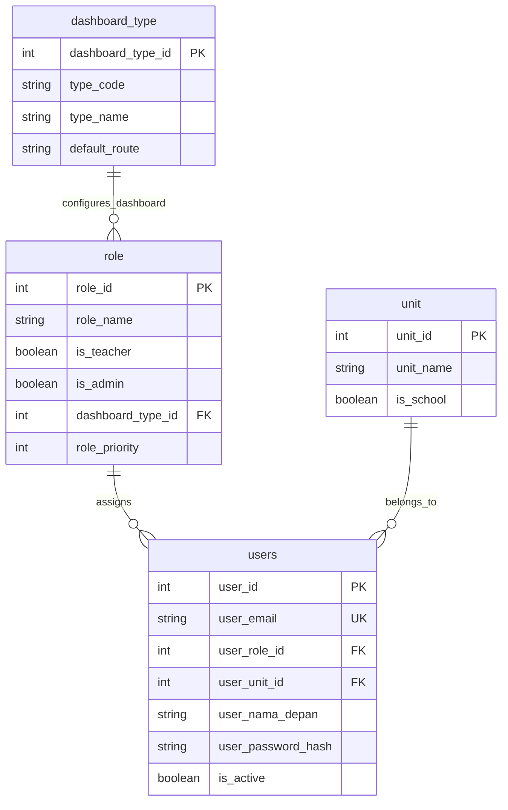
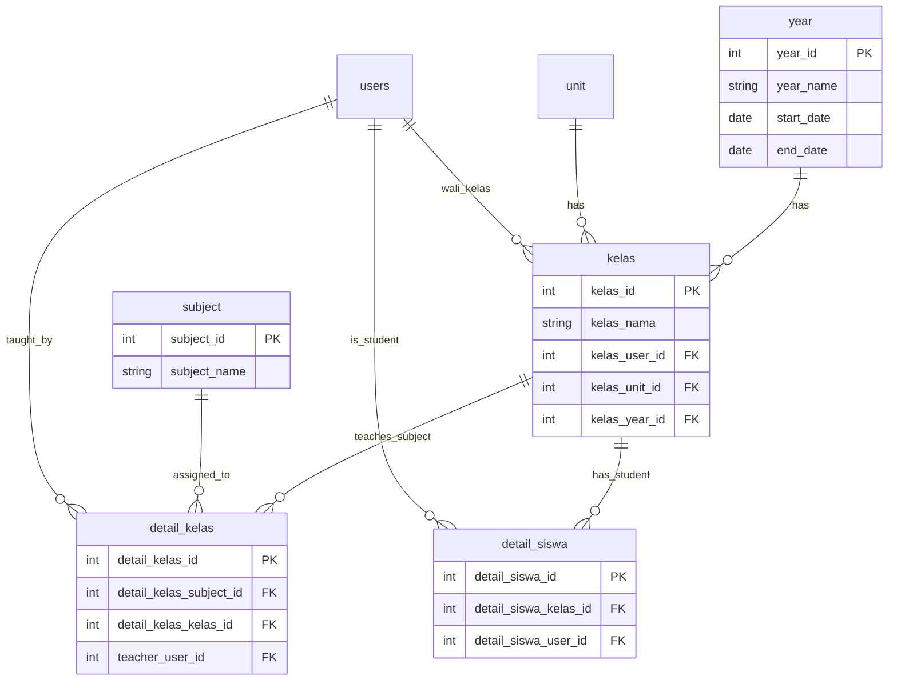
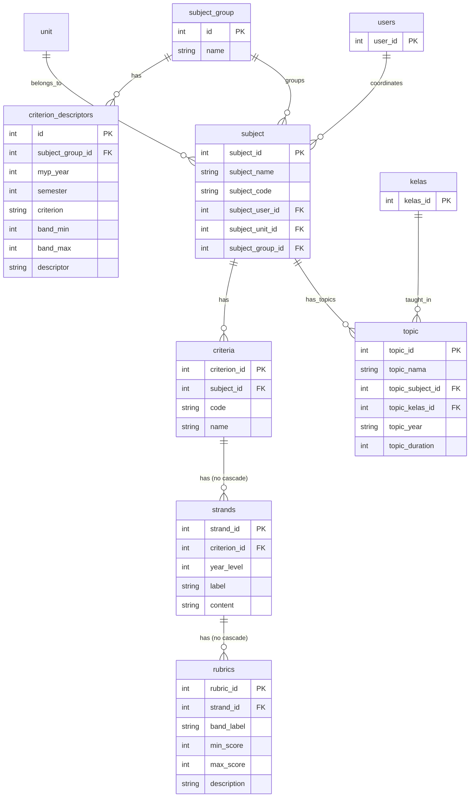
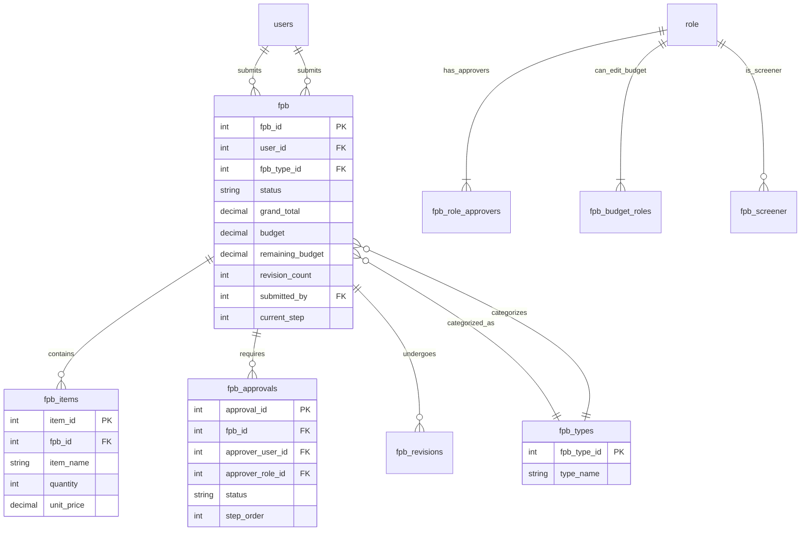
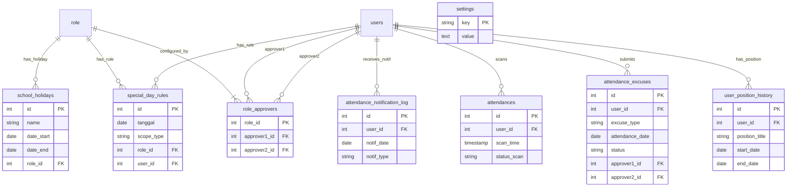
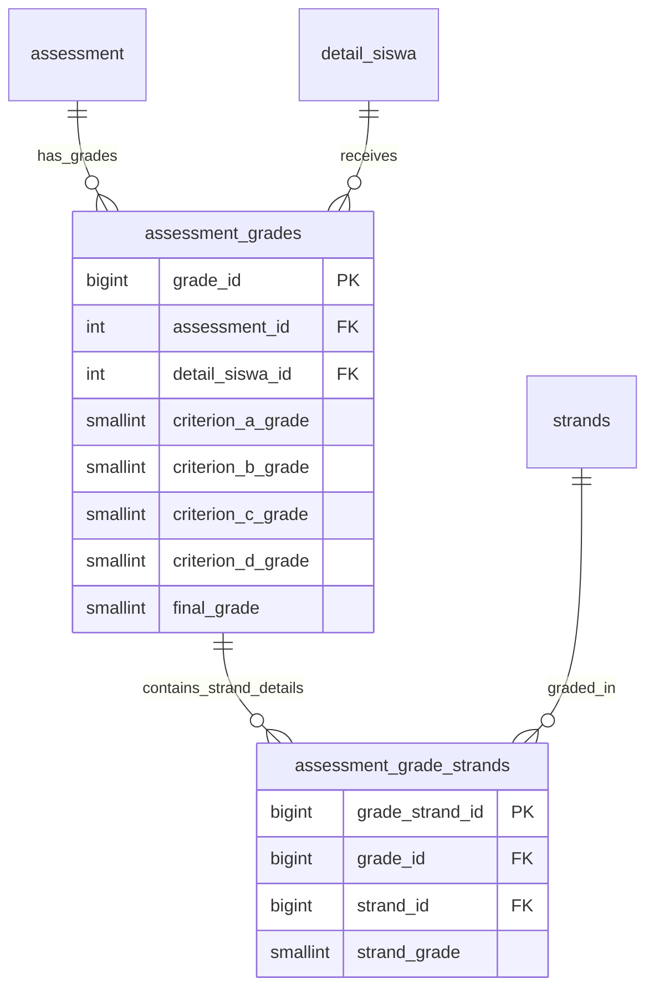
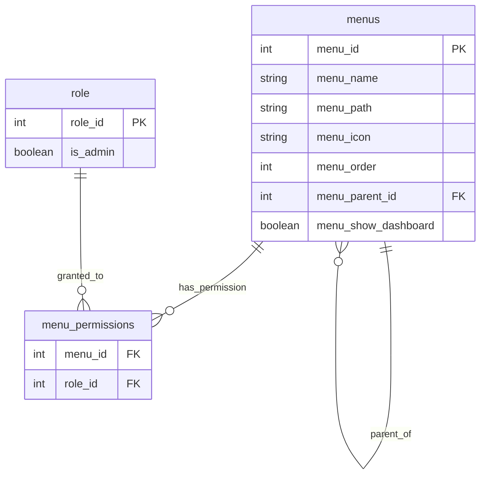

# Database Schema & Relationships

## 1. User Management Domain (`/data/user`)

This domain handles the core users of the system, their roles, and organizational units. It is centered around the `users` table.

### 1.1 Tables

#### `users`
The main table storing user accounts (staff, teachers, admin, students, etc).

| Column Name | Type | Description / Constraint |
| --- | --- | --- |
| `user_id` | `SERIAL` | Primary Key |
| `user_nama_depan` | `VARCHAR(100)` | First Name |
| `user_nama_belakang`| `VARCHAR(100)` | Last Name |
| `user_email` | `VARCHAR(100)` | Unique, User's email |
| `user_role_id` | `INTEGER` | Foreign Key to `role(role_id)` |
| `user_unit_id` | `INTEGER` | Foreign Key to `unit(unit_id)` |
| `is_active` | `BOOLEAN` | Default `true` |
| `user_profile_picture`| `TEXT` | URL to profile picture |
| `user_phone` | `VARCHAR(20)` | Phone number |
| `user_bio` | `TEXT` | Biography/Notes |
| `user_birth_date` | `DATE` | Date of birth |
| `user_address` | `TEXT` | Address |
| `user_pin` | `VARCHAR` | PIN for machine attendance |
| `expected_check_in` | `TIME` | Expected arrival time |
| `expected_check_out`| `TIME` | Expected departure time |
| `join_date` | `DATE` | Date joined |
| `user_theme` | `VARCHAR` | User UI theme preference |
| `user_password_hash`| `VARCHAR` | Bcrypt password hash |
| `user_created_at` | `TIMESTAMP` | Record creation date |
| `user_updated_at` | `TIMESTAMP` | Record update date |

> [!NOTE]
> `user_username` column existed previously but was dropped during migration (`drop-user-username-column.sql`).

#### `role`
Defines the permissions and types of users in the system.

| Column Name | Type | Description / Constraint |
| --- | --- | --- |
| `role_id` | `SERIAL` | Primary Key |
| `role_name` | `VARCHAR(50)` | Name of the role (e.g. Admin, Teacher, Staff) |
| `is_teacher` | `BOOLEAN` | Default `false` |
| `is_admin` | `BOOLEAN` | Default `false` |
| `is_principal` | `BOOLEAN` | Default `false` |
| `is_student` | `BOOLEAN` | Default `false` |
| `is_vendor` | `BOOLEAN` | Flag for vendor roles |
| `is_part_time_staff`| `BOOLEAN` | Flag for part-time staff |
| `work_days` | `VARCHAR` | CSV of work days (e.g. "1,2,3,4,5" for Mon-Fri) |
| `dashboard_type_id` | `INTEGER` | Foreign Key to `dashboard_type(dashboard_type_id)` |
| `role_priority` | `INTEGER` | Priority for routing (higher number = higher priority) |

#### `dashboard_type`
Defines the dashboard routing layout and default landing page for different roles (e.g., student, teacher, purchasing).

| Column Name | Type | Description / Constraint |
| --- | --- | --- |
| `dashboard_type_id` | `SERIAL` | Primary Key |
| `type_code` | `VARCHAR` | Short code (e.g., admin, teacher, student) |
| `type_name` | `VARCHAR` | Display name of the dashboard type |
| `type_description`| `TEXT` | Optional description |
| `default_route` | `VARCHAR` | The default path to redirect to (e.g., `/dashboard/purchasing`) |
| `is_active` | `BOOLEAN` | Whether this layout is active |

#### `unit`
Represents the school level, department or division the user belongs to.

| Column Name | Type | Description / Constraint |
| --- | --- | --- |
| `unit_id` | `SERIAL` | Primary Key |
| `unit_name` | `VARCHAR(100)`| Name (e.g. Primary, Secondary, Management) |
| `is_school` | `BOOLEAN` | `true` for school unit, `false` for management |

### 1.2 ERD / Relationships (User Domain)

### 1.3 Tables referencing `users`
Many tables in the system reference `users` for ownership, assignment or action tracking:
- **Academic Setup:** `kelas` (`kelas_user_id` as Wali Kelas)
- **Subjects:** `subject` (`subject_user_id` as Teacher)
- **Assessments:** `assessment` (`assessment_user_id` as Teacher)
- **Timetable:** `timetable` (`timetable_user_id`)
- **Greeter:** `daftar_door_greeter` (`daftar_door_greeter_user_id`)
- **Attendance:** `attendance`, `attendance_scan_log`
- **Leave/Quota:** `leave_quotas` (`user_id`), `leave_requests` (`user_id`)
- **Purchasing:** `unit_approvers` (`user_id`), `role_approvers` (`user_id`)
- **Logs/Tracking:** Countless tables via `created_by_user_id`

---

## 2. Academic & Class Management Domain (`/data/class`)

This domain handles the core structure for academic years, classes, and assigning students and subjects to these classes.

### 2.1 Tables

#### `year`
Stores the academic years.

| Column Name | Type | Description / Constraint |
| --- | --- | --- |
| `year_id` | `SERIAL` | Primary Key |
| `year_name` | `VARCHAR(50)` | Unique, e.g. "2025/2026" |
| `start_date` | `DATE` | Start date of the academic year |
| `end_date` | `DATE` | End date of the academic year |

#### `kelas`
The main table for classes.

| Column Name | Type | Description / Constraint |
| --- | --- | --- |
| `kelas_id` | `SERIAL` | Primary Key |
| `kelas_nama` | `VARCHAR(50)` | Name of the class (e.g. "7A") |
| `kelas_user_id` | `INTEGER` | FK to `users(user_id)` (Wali Kelas / Homeroom Teacher) |
| `kelas_unit_id` | `INTEGER` | FK to `unit(unit_id)` |
| `kelas_year_id` | `INTEGER` | FK to `year(year_id)` |
| `kelas_color_name` | `VARCHAR(20)` | UI badge color ('success', 'warning', 'error') |

#### `detail_kelas`
Maps a class to a specific subject, and assigns a teacher who will teach that subject for that class.

| Column Name | Type | Description / Constraint |
| --- | --- | --- |
| `detail_kelas_id` | `SERIAL` | Primary Key |
| `detail_kelas_subject_id` | `INTEGER` | FK to `subject(subject_id)` |
| `detail_kelas_kelas_id` | `INTEGER` | FK to `kelas(kelas_id)` |
| `teacher_user_id` | `INTEGER` | FK to `users(user_id)` (Subject Teacher) |

#### `detail_siswa`
Assigns a student to a specific class.

| Column Name | Type | Description / Constraint |
| --- | --- | --- |
| `detail_siswa_id` | `SERIAL` | Primary Key |
| `detail_siswa_kelas_id` | `INTEGER` | FK to `kelas(kelas_id)` |
| `detail_siswa_user_id` | `INTEGER` | FK to `users(user_id)` (The Student) |

### 2.2 ERD / Relationships (Class Domain)

---

## 3. Curriculum & Topics Domain (`/data/topic-new`, `/data/subject`, `/data/subject-group`)

This domain manages the academic curriculum, focusing on subjects, MYP criteria, rubrics, and detailed topics (IB MYP Unit Planners).

> [!CAUTION]
> **No ON DELETE CASCADE.** Foreign key constraints in this domain are **NOT** configured with `ON DELETE CASCADE`. This means the application code **MUST manually delete child records first** before deleting a parent record. The required deletion order is:
> 1. `rubrics` (delete first, FK to `strands`)
> 2. `strands` (delete second, FK to `criteria`)
> 3. `criteria` (delete third, FK to `subject`)
>
> Skipping this order will result in: `violates foreign key constraint "strands_criterion_id_fkey"` or similar errors from Supabase/Postgres.

### 3.1 Tables

#### `subject_group`
Categorizes subjects into standard MYP Groups (e.g., Language Acquisition, Sciences).

| Column Name | Type | Description / Constraint |
| --- | --- | --- |
| `id` | `SERIAL` | Primary Key |
| `name` | `VARCHAR` | Name of the group |

#### `subject`
Represents the subjects taught in the school.

| Column Name | Type | Description / Constraint |
| --- | --- | --- |
| `subject_id` | `SERIAL` | Primary Key |
| `subject_name` | `VARCHAR(100)` | Name of the subject |
| `subject_user_id` | `INTEGER` | FK to `users(user_id)` (Subject Coordinator/Teacher) |
| `subject_unit_id` | `INTEGER` | FK to `unit(unit_id)` |
| `subject_code` | `VARCHAR(30)` | Short code (e.g., MATH7A) |
| `subject_guide` | `TEXT` | URL to subject guide (Google Drive/PDF) |
| `subject_icon` | `TEXT` | URL or class name of the icon |
| `grading_method` | `VARCHAR(20)` | IB MYP grading method: `'highest'`, `'average'`, `'median'`, `'mode'`. Default `'highest'` |
| `core_subject` | `BOOLEAN` | Is this a core subject? |
| `is_community_project` | `BOOLEAN` | Is this a community project? |
| `print_order` | `INTEGER` | Order on printouts/reports |
| `include_in_print` | `BOOLEAN` | Whether to include in report cards |
| `subject_group_id` | `INTEGER` | FK to `subject_group(id)` |
| `custom_grade_boundaries` | `TEXT/JSON` | Custom grade boundaries configuration |

#### `criteria`
Stores IB MYP Assessment Criteria for a subject (e.g., Criterion A, B, C, D).

| Column Name | Type | Description / Constraint |
| --- | --- | --- |
| `criterion_id` | `SERIAL` | Primary Key |
| `subject_id` | `INTEGER` | FK to `subject(subject_id)` |
| `code` | `VARCHAR` | Letter code, e.g. A, B, C, D |
| `name` | `VARCHAR` | Full name, e.g. Knowing and understanding |

#### `strands`
Stores the detailed strands for each criterion across different MYP years.

| Column Name | Type | Description / Constraint |
| --- | --- | --- |
| `strand_id` | `SERIAL` | Primary Key |
| `criterion_id` | `INTEGER` | FK to `criteria(criterion_id)` — **no ON DELETE CASCADE** |
| `year_level` | `INTEGER` | MYP Year (1, 3, 5) |
| `label` | `VARCHAR` | Strand identifier (i, ii, iii) |
| `content` | `TEXT` | The strand description |

#### `rubrics`
Stores the grading rubrics/achievement levels for each strand.

| Column Name | Type | Description / Constraint |
| --- | --- | --- |
| `rubric_id` | `SERIAL` | Primary Key |
| `strand_id` | `INTEGER` | FK to `strands(strand_id)` — **no ON DELETE CASCADE** |
| `band_label` | `VARCHAR` | Level band (e.g., "1-2", "3-4") |
| `min_score` | `INTEGER` | Minimum score for this band |
| `max_score` | `INTEGER` | Maximum score for this band |
| `description` | `TEXT` | Description of achievement at this level |

#### `criterion_descriptors`
Stores MYP year-level task-specific descriptors by subject group and semester.

| Column Name | Type | Description / Constraint |
| --- | --- | --- |
| `id` | `SERIAL` | Primary Key |
| `subject_group_id` | `INTEGER` | FK to `subject_group(id)` |
| `myp_year` | `INTEGER` | MYP Year (e.g., 1, 3, 5) |
| `semester` | `INTEGER` | Semester 1 or 2 |
| `criterion` | `VARCHAR` | A, B, C, or D |
| `band_min` | `INTEGER` | Minimum score bound |
| `band_max` | `INTEGER` | Maximum score bound |
| `descriptor` | `TEXT` | The general descriptor text |

#### `topic`
Represents an IB MYP Unit Planner / Topic. Contains extensive fields for IB MYP planning.

| Column Name | Type | Description / Constraint |
| --- | --- | --- |
| `topic_id` | `SERIAL` | Primary Key |
| `topic_nama` | `VARCHAR(100)` | Unit Title / Topic Name |
| `topic_subject_id` | `INTEGER` | FK to `subject(subject_id)` |
| `topic_kelas_id` | `INTEGER` | FK to `kelas(kelas_id)` |
| `topic_year` | `VARCHAR` | Academic year context |
| `topic_urutan` | `INTEGER` | Ordering / Sequence of the topic |
| `topic_duration` | `INTEGER` | Duration in weeks |
| `topic_hours_per_week` | `INTEGER` | Hours per week |
| `topic_planner` | `TEXT` | URL to external planner |
| `topic_inquiry_question` | `TEXT` | Factual, Conceptual, Debatable questions |
| `topic_global_context` | `TEXT` | IB Global Context |
| `topic_gc_exploration` | `TEXT` | IB Global Context Exploration |
| `topic_key_concept` | `TEXT` | IB Key Concept |
| `topic_related_concept` | `TEXT` | IB Related Concepts |
| `topic_statement` | `TEXT` | Statement of Inquiry |
| `topic_conceptual_understanding` | `TEXT` | Conceptual Understanding |
| `topic_learner_profile` | `TEXT` | Learner Profile Attributes |
| `topic_service_learning` | `TEXT` | Service as action / Service learning |
| `topic_atl` | `TEXT` | Approaches to Learning (ATL) skills |
| `topic_learning_process` | `TEXT` | Learning Process description |
| `topic_formative_assessment` | `TEXT` | Formative assessments |
| `topic_summative_assessment` | `TEXT` | Summative assessments |
| `topic_relationship_summative_assessment_statement_of_inquiry` | `TEXT` | Relationship description |
| `topic_reflection_prior` | `TEXT` | Reflection prior to teaching |
| `topic_reflection_after` | `TEXT` | Reflection after teaching |

### 3.2 ERD / Relationships (Curriculum Domain)

---

## 4. Purchasing & Budgeting Domain (/data/fpb)

This domain handles the 'Form Pengajuan Barang' (FPB) or Purchase Request system, tracking requests, line items, and multi-step approvals.

### 4.1 Tables

#### `fpb`
The main header table for a purchase request.

| Column Name | Type | Description / Constraint |
| --- | --- | --- |
| `fpb_id` | `SERIAL` | Primary Key |
| `fpb_number` | `VARCHAR` | Unique identifier/document number |
| `fpb_type_id` | `INTEGER` | FK to `fpb_types` (e.g. General, Special) |
| `division` | `VARCHAR` | Division requesting the items |
| `submitted_by` | `INTEGER` | FK to `users(user_id)` |
| `grand_total` | `DECIMAL` | Total amount of the request |
| `note` | `TEXT` | Additional notes or justification |
| `usage_date` | `DATE` | When the items are needed |
| `status` | `VARCHAR` | `pending`, `approved`, `revision`, `rejected` |
| `current_step` | `INTEGER` | The current approval step |
| `revision_count` | `INTEGER` | Number of times revised |

#### `fpb_items`
The line items requested within an FPB.

| Column Name | Type | Description / Constraint |
| --- | --- | --- |
| `item_id` | `SERIAL` | Primary Key |
| `fpb_id` | `INTEGER` | FK to `fpb(fpb_id)` |
| `item_name` | `VARCHAR` | Name of the requested item |
| `quantity` | `INTEGER` | Quantity requested |
| `unit` | `VARCHAR` | Unit of measurement (pcs, box, etc) |
| `unit_price` | `DECIMAL` | Estimated price per unit |

#### `fpb_approvals`
Tracks the approval state for each required step of an FPB.

| Column Name | Type | Description / Constraint |
| --- | --- | --- |
| `approval_id` | `SERIAL` | Primary Key |
| `fpb_id` | `INTEGER` | FK to `fpb(fpb_id)` |
| `step_order` | `INTEGER` | Sequence of approval (1, 2, 3...) |
| `step_name` | `VARCHAR` | Name of the step (e.g. Principal Approval) |
| `approver_user_id`| `INTEGER` | FK to `users(user_id)` |
| `approver_role_id`| `INTEGER` | FK to `role(role_id)` (Role-based approver) |
| `status` | `VARCHAR` | `pending`, `approved`, `rejected` |
| `comment` | `TEXT` | Approver's note |
| `action_at` | `TIMESTAMP` | When the approval was actioned |

#### `fpb_types`
Defines the types of FPB available and their maximum limits.

| Column Name | Type | Description / Constraint |
| --- | --- | --- |
| `id` | `SERIAL` | Primary Key |
| `type_code` | `VARCHAR` | Short code (e.g., KCL, BSR) |
| `type_name` | `VARCHAR` | Full name of the FPB type |
| `max_amount` | `DECIMAL` | Maximum allowed grand total |
| `is_active` | `BOOLEAN` | Whether this type is selectable |

#### `fpb_approval_steps`
Configuration table that defines the default approval routing steps for each FPB type.

#### `fpb_role_approvers`
Maps a specific role to up to 3 specific users who act as approvers on behalf of that role.

| Column Name | Type | Description / Constraint |
| --- | --- | --- |
| `id` | `SERIAL` | Primary Key |
| `role_id` | `INTEGER` | FK to `role(role_id)`, UNIQUE |
| `approver1_id`| `INTEGER` | FK to `users(user_id)` |
| `approver2_id`| `INTEGER` | FK to `users(user_id)` |
| `approver3_id`| `INTEGER` | FK to `users(user_id)` |

#### `fpb_budget_roles`
Defines which roles have the authority to edit budget fields on an FPB.

| Column Name | Type | Description / Constraint |
| --- | --- | --- |
| `id` | `SERIAL` | Primary Key |
| `role_id` | `INTEGER` | FK to `role(role_id)` |

#### `fpb_screener`
Defines the single role that acts as the initial screener (Step 0) for all FPBs.

| Column Name | Type | Description / Constraint |
| --- | --- | --- |
| `id` | `SERIAL` | Primary Key |
| `screener_role_id`| `INTEGER` | FK to `role(role_id)` |

#### `fpb_revisions`
Tracks the history of revision requests (when an approver sends the FPB back).

| Column Name | Type | Description / Constraint |
| --- | --- | --- |
| `id` | `SERIAL` | Primary Key |
| `fpb_id` | `INTEGER` | FK to `fpb(fpb_id)` |
| `revision_number`| `INTEGER` | 1, 2, 3... |
| `revised_by` | `INTEGER` | FK to `users(user_id)` |
| `revision_note`| `TEXT` | Reason for revision |

### 4.2 ERD / Relationships (Purchasing Domain)

---

## 5. Attendance & Leave Management Domain (`/data/attendance-settings`)

This domain handles the attendance settings, special days, holidays, notifications, and approver mappings.

### 5.1 Tables

#### `school_holidays`
Stores global or role-specific school holidays.

| Column Name | Type | Description / Constraint |
| --- | --- | --- |
| `id` | `SERIAL` | Primary Key |
| `name` | `VARCHAR` | Name of the holiday |
| `date_start` | `DATE` | Start date of the holiday |
| `date_end` | `DATE` | End date of the holiday |
| `role_id` | `INTEGER` | FK to `role(role_id)`. Null for global holiday. |
| `date` | `DATE` | Backward compatibility |

#### `special_day_rules`
Stores custom attendance rules for specific dates (e.g., event days) affecting all, a role, or a single user.

| Column Name | Type | Description / Constraint |
| --- | --- | --- |
| `id` | `SERIAL` | Primary Key |
| `tanggal` | `DATE` | Date the rule applies to |
| `scope_type` | `VARCHAR` | Scope: `all`, `role`, or `user` |
| `role_id` | `INTEGER` | FK to `role(role_id)` (if scope_type is `role`) |
| `user_id` | `INTEGER` | FK to `users(user_id)` (if scope_type is `user`) |
| `is_work_day` | `BOOLEAN` | Indicates if this day requires attendance |
| `custom_check_in` | `TIME` | Overrides default check-in time |
| `custom_check_out`| `TIME` | Overrides default check-out time |
| `keterangan` | `TEXT` | Notes |
| `created_at` | `TIMESTAMP`| Record creation time |

#### `attendances`
Stores the raw machine scan logs. Note: Check-in vs check-out is determined dynamically via time midpoint, not `status_scan`.

| Column Name | Type | Description / Constraint |
| --- | --- | --- |
| `id` | `SERIAL` | Primary Key |
| `user_id` | `INTEGER` | FK to `users(user_id)` |
| `scan_time` | `TIMESTAMPTZ`| When the user scanned |
| `status_scan` | `VARCHAR` | Check-in or check-out (not fully reliable) |

#### `attendance_excuses`
Stores excuse forms (surat keterangan) for attendance anomalies (late, absent, etc).

| Column Name | Type | Description / Constraint |
| --- | --- | --- |
| `id` | `SERIAL` | Primary Key |
| `user_id` | `INTEGER` | FK to `users(user_id)` (The submitter) |
| `excuse_type` | `VARCHAR` | `late`, `leave_early`, `absent`, `no_checkin`, `no_checkout` |
| `attendance_date`| `DATE` | The date of the anomaly |
| `late_minutes` | `INTEGER` | Minutes late (if applicable) |
| `category` | `VARCHAR` | Reason category (e.g. sick, annual_leave) |
| `other_reason` | `TEXT` | Additional explanation |
| `attachment_url` | `TEXT` | URL to attached proof |
| `status` | `VARCHAR` | `pending`, `approved_1`, `approved`, `rejected` |
| `approver1_id` | `INTEGER` | FK to `users(user_id)` |
| `approver2_id` | `INTEGER` | FK to `users(user_id)` |
| `approver1_action`| `VARCHAR` | `approved` or `rejected` |
| `approver1_note` | `TEXT` | Note from approver 1 |
| `approver1_at` | `TIMESTAMP`| Action timestamp |
| `approver2_action`| `VARCHAR` | `approved` or `rejected` |
| `approver2_note` | `TEXT` | Note from approver 2 |
| `approver2_at` | `TIMESTAMP`| Action timestamp |

#### `user_position_history`
Tracks the position title of a user over time for reporting.

| Column Name | Type | Description / Constraint |
| --- | --- | --- |
| `id` | `SERIAL` | Primary Key |
| `user_id` | `INTEGER` | FK to `users(user_id)` |
| `position_title` | `VARCHAR` | Title of the position |
| `start_date` | `DATE` | When the position started |
| `end_date` | `DATE` | When the position ended (null if active) |

#### `role_approvers`
Maps roles to their specific approvers (used for leave/attendance requests).

| Column Name | Type | Description / Constraint |
| --- | --- | --- |
| `role_id` | `INTEGER` | Primary Key, FK to `role(role_id)` |
| `approver1_id` | `INTEGER` | FK to `users(user_id)` (First approver) |
| `approver2_id` | `INTEGER` | FK to `users(user_id)` (Second approver, optional) |

#### `settings`
Global configuration key-value store.

| Column Name | Type | Description / Constraint |
| --- | --- | --- |
| `key` | `VARCHAR` | Primary Key (e.g., `attendance_notif_admin_emails`) |
| `value` | `TEXT` | Value of the setting |

#### `attendance_notification_log`
Tracks attendance violation emails sent to users.

| Column Name | Type | Description / Constraint |
| --- | --- | --- |
| `id` | `SERIAL` | Primary Key |
| `user_id` | `INTEGER` | FK to `users(user_id)` |
| `notif_date` | `DATE` | Target date of the attendance issue |
| `notif_type` | `VARCHAR` | E.g., `late`, `leave_early`, `no_checkin`, `no_checkout` |
| `minutes_diff` | `INTEGER` | Minutes late or early |
| `scheduled_time`| `TIME` | Expected time |
| `actual_time` | `TIME` | Actual scan time |
| `email_to` | `JSON/ARRAY`| Email recipient(s) |
| `success` | `BOOLEAN` | True if sent successfully, null if skipped |
| `sent_at` | `TIMESTAMP`| When the email was sent |

#### `attendance_notify_run_log`
Tracks the daily run of the cron job that processes attendance notifications.

| Column Name | Type | Description / Constraint |
| --- | --- | --- |
| `id` | `SERIAL` | Primary Key |
| `ran_at` | `TIMESTAMP`| Default to now() |
| `target_date` | `DATE` | The date being processed (usually yesterday) |
| `users_processed` | `INTEGER` | Number of users analyzed |
| `violations_found`| `INTEGER` | Total issues found |
| `emails_sent` | `INTEGER` | Total emails sent |
| `emails_failed` | `INTEGER` | Total emails failed |
| `admin_emails` | `JSON/ARRAY`| Admin email recipients |
| `admin_email_ok`| `BOOLEAN` | Success status of admin summary |
| `skipped_reason`| `TEXT` | Reason if skipping execution |
| `error_message` | `TEXT` | Any error during run |

### 5.2 ERD / Relationships (Attendance Domain)

---

## 6. Assessment & Grading Domain (`/data/topic-new` / Reports)

This domain handles the IB MYP grading system, storing the grades given by teachers to students based on assessments and criteria strands.

### 6.1 Tables

#### `assessment_grades`
Stores the final summarized grades for a student per assessment, including criterion grades (A-D) and the final MYP grade.

| Column Name | Type | Description / Constraint |
| --- | --- | --- |
| `grade_id` | `BIGSERIAL` | Primary Key |
| `assessment_id` | `INTEGER` | FK to `assessment(assessment_id)` ON DELETE CASCADE |
| `detail_siswa_id` | `INTEGER` | FK to `detail_siswa(detail_siswa_id)` ON DELETE CASCADE |
| `criterion_a_grade` | `SMALLINT` | 0-8 scale (Highest strand grade for Criterion A) |
| `criterion_b_grade` | `SMALLINT` | 0-8 scale (Highest strand grade for Criterion B) |
| `criterion_c_grade` | `SMALLINT` | 0-8 scale (Highest strand grade for Criterion C) |
| `criterion_d_grade` | `SMALLINT` | 0-8 scale (Highest strand grade for Criterion D) |
| `final_grade` | `SMALLINT` | 1-7 scale (Based on sum of criteria A-D) |
| `comments` | `TEXT` | Teacher's comments |
| `created_by_user_id` | `INTEGER` | FK to `users(user_id)` |
| `updated_by_user_id` | `INTEGER` | FK to `users(user_id)` |

> [!NOTE]
> **Calculation Rules:**
> - **Criterion Grade:** Uses "best-fit" approach, calculated as the **highest** strand grade within that criterion (`Math.max(...strand_grades)`).
> - **Final Grade:** Sum of all 4 criteria (max 32). Converted to 1-7 scale: 1-5 (1), 6-9 (2), 10-14 (3), 15-18 (4), 19-23 (5), 24-27 (6), 28-32 (7).

#### `assessment_grade_strands`
Stores the detailed score (0-8) for each specific strand (i, ii, iii, iv) for a student in an assessment.

| Column Name | Type | Description / Constraint |
| --- | --- | --- |
| `grade_strand_id` | `BIGSERIAL` | Primary Key |
| `grade_id` | `BIGINT` | FK to `assessment_grades(grade_id)` ON DELETE CASCADE |
| `strand_id` | `BIGINT` | FK to `strands(strand_id)` ON DELETE CASCADE |
| `strand_grade` | `SMALLINT` | Grade for this specific strand (0-8 scale) |
| `notes` | `TEXT` | Additional notes for this strand |

### 6.2 ERD / Relationships (Assessment & Grading)

---

## 7. Menu & Role Permissions Domain (`/data/menu_management`)

This domain handles the dynamic sidebar menus and dashboard cards, as well as the role-based access control (RBAC) linking which roles can access which menus.

### 7.1 Tables

#### `menus`
Stores the hierarchical structure of the application menus.

| Column Name | Type | Description / Constraint |
| --- | --- | --- |
| `menu_id` | `SERIAL` | Primary Key |
| `menu_name` | `VARCHAR` | Display name of the menu |
| `menu_path` | `VARCHAR` | URL path for navigation (e.g., `/data/class`) |
| `menu_icon` | `VARCHAR` | FontAwesome icon class (e.g., `fas fa-table`) |
| `menu_order` | `INTEGER` | Sorting order for display |
| `menu_parent_id` | `INTEGER` | FK to `menus(menu_id)` for submenus (nullable) |
| `menu_show_dashboard`| `BOOLEAN` | If true, this menu also appears as a card on the dashboard |

#### `menu_permissions`
Junction table that maps which roles have access to which menus.

| Column Name | Type | Description / Constraint |
| --- | --- | --- |
| `menu_id` | `INTEGER` | FK to `menus(menu_id)` |
| `role_id` | `INTEGER` | FK to `role(role_id)` |
| `(menu_id, role_id)` | `PK/UNIQUE`| Composite Constraint |

> [!NOTE]
> Admins (users where `role.is_admin` is true) implicitly have access to all menus regardless of entries in the `menu_permissions` table.

### 7.2 ERD / Relationships (Menu Domain)

