# Database Schema & Relationships

## 1. User, Role & Unit Management Domain (`/data/user`, `/data/role_management`, `/settings/unit`)

This domain handles the core users of the system, their roles, organizational units, and unit-level report card configurations. It is centered around `users`, `unit`, and `report_settings`.

### 1.1 Tables

#### `users`
The main table storing user accounts (staff, teachers, admin, students, etc).

| Column Name | Type | Description / Constraint |
| --- | --- | --- |
| `user_id` | `SERIAL` | Primary Key |
| `user_nama_depan` | `VARCHAR(100)` | First Name |
| `user_nama_belakang`| `VARCHAR(100)` | Last Name |
| `user_email` | `VARCHAR(100)` | Unique, User's email |
| `user_role_id` | `INTEGER` | Foreign Key to `role(role_id)` |
| `user_unit_id` | `INTEGER` | Foreign Key to `unit(unit_id)` |
| `is_active` | `BOOLEAN` | Default `true` |
| `user_profile_picture`| `TEXT` | URL to profile picture |
| `user_phone` | `VARCHAR(20)` | Phone number |
| `user_bio` | `TEXT` | Biography/Notes |
| `user_birth_date` | `DATE` | Date of birth |
| `user_address` | `TEXT` | Address |
| `user_pin` | `VARCHAR` | PIN for machine attendance |
| `expected_check_in` | `TIME` | Expected arrival time |
| `expected_check_out`| `TIME` | Expected departure time |
| `join_date` | `DATE` | Date joined |
| `signature_url` | `TEXT` | Public URL to user/teacher signature image (Storage: `report-assets/user-signatures/{user_id}/signature.png`) |
| `user_theme` | `VARCHAR` | User UI theme preference |
| `user_password_hash`| `VARCHAR` | Bcrypt password hash |
| `user_created_at` | `TIMESTAMP` | Record creation date |
| `user_updated_at` | `TIMESTAMP` | Record update date |

> [!NOTE]
> `user_username` column existed previously but was dropped during migration (`drop-user-username-column.sql`).

#### `role`
Defines the permissions and types of users in the system.

| Column Name | Type | Description / Constraint |
| --- | --- | --- |
| `role_id` | `SERIAL` | Primary Key |
| `role_name` | `VARCHAR(50)` | Name of the role (e.g. Admin, Teacher, Staff) |
| `is_teacher` | `BOOLEAN` | Default `false` |
| `is_admin` | `BOOLEAN` | Default `false` |
| `is_principal` | `BOOLEAN` | Default `false` |
| `is_student` | `BOOLEAN` | Default `false` |
| `is_counselor` | `BOOLEAN` | Flag for counselor roles |
| `is_pastoral_care` | `BOOLEAN` | Flag for Pastoral Care roles |
| `is_curriculum` | `BOOLEAN` | Flag for curriculum roles |
| `is_nurse` | `BOOLEAN` | Flag for nurse/clinic roles |
| `is_vendor` | `BOOLEAN` | Flag for vendor roles |
| `is_part_time_staff`| `BOOLEAN` | Flag for part-time staff (bypasses all attendance checks 100%) |
| `is_flexible_hours` | `BOOLEAN` | Flag for flexible work hours (requires check-in/out on work days, but 0 lateness/early departure penalty) |
| `is_on_call_staff`  | `BOOLEAN` | Flag for on-call/honor staff (bypasses absence/alfa counts, but strictly records & calculates lateness/early departure when present) |
| `can_void_transactions`| `BOOLEAN`| Flag granting permission to void/cancel transactions |
| `work_days` | `VARCHAR` | CSV of work days (e.g. "1,2,3,4,5" for Mon-Fri) |
| `dashboard_type_id` | `INTEGER` | Foreign Key to `dashboard_type(dashboard_type_id)` |
| `role_priority` | `INTEGER` | Priority for routing (higher number = higher priority) |

#### `dashboard_type`
Defines the dashboard routing layout and default landing page for different roles (e.g., student, teacher, purchasing).

| Column Name | Type | Description / Constraint |
| --- | --- | --- |
| `dashboard_type_id` | `SERIAL` | Primary Key |
| `type_code` | `VARCHAR` | Short code (e.g., admin, teacher, student) |
| `type_name` | `VARCHAR` | Display name of the dashboard type |
| `type_description`| `TEXT` | Optional description |
| `default_route` | `VARCHAR` | The default path to redirect to (e.g., `/dashboard/purchasing`) |
| `is_active` | `BOOLEAN` | Whether this layout is active |

#### `unit`
Represents the school level, department or division the user belongs to.

| Column Name | Type | Description / Constraint |
| --- | --- | --- |
| `unit_id` | `SERIAL` | Primary Key |
| `unit_name` | `VARCHAR(100)`| Name (e.g. Primary, Secondary, Management) |
| `is_school` | `BOOLEAN` | `true` for school unit, `false` for management |
| `is_pyp` | `BOOLEAN` | Default `false`, flag for Primary Years Programme (PYP) unit |
| `is_myp` | `BOOLEAN` | Default `false`, flag for Middle Years Programme (MYP) unit |
| `is_dp` | `BOOLEAN` | Default `false`, flag for Diploma Programme (DP) unit |

#### `report_settings`
Configures per-unit and per-academic-year report card metadata (principal details, signatures, stamps, semester greetings, and report dates) managed via `/settings/unit` and consumed by student report card PDF generation.

| Column Name | Type | Description / Constraint |
| --- | --- | --- |
| `id` | `SERIAL` | Primary Key |
| `unit_id` | `INTEGER` | Foreign Key to `unit(unit_id)` ON DELETE CASCADE |
| `year_id` | `INTEGER` | Foreign Key to `year(year_id)` ON DELETE CASCADE |
| `principal_name` | `VARCHAR` | Full name of the principal for this unit and academic year |
| `principal_title` | `VARCHAR` | Official title of the principal (e.g. "Kepala Sekolah", "Principal") |
| `report_greeting_s1` | `TEXT` | Report card greeting / remarks text for Semester 1 |
| `report_greeting_s2` | `TEXT` | Report card greeting / remarks text for Semester 2 |
| `report_date_s1` | `DATE` | Official report issuance date for Semester 1 |
| `report_date_s2` | `DATE` | Official report issuance date for Semester 2 |
| `signature_principal_url` | `TEXT` | Public URL to uploaded principal signature PNG image (Storage bucket: `report-assets`) |
| `stamp_url` | `TEXT` | Public URL to uploaded school stamp/seal PNG image (Storage bucket: `report-assets`) |
| `(unit_id, year_id)` | `UNIQUE` | Unique constraint per unit and academic year |

> [!NOTE]
> **Report Assets Storage:** Signature and stamp images uploaded via `/settings/unit` are stored in the `report-assets` Supabase storage bucket under the path `{unit_id}/{year_id}/{signature_principal|stamp}.png`.


### 1.2 ERD / Relationships (User & Unit Domain)

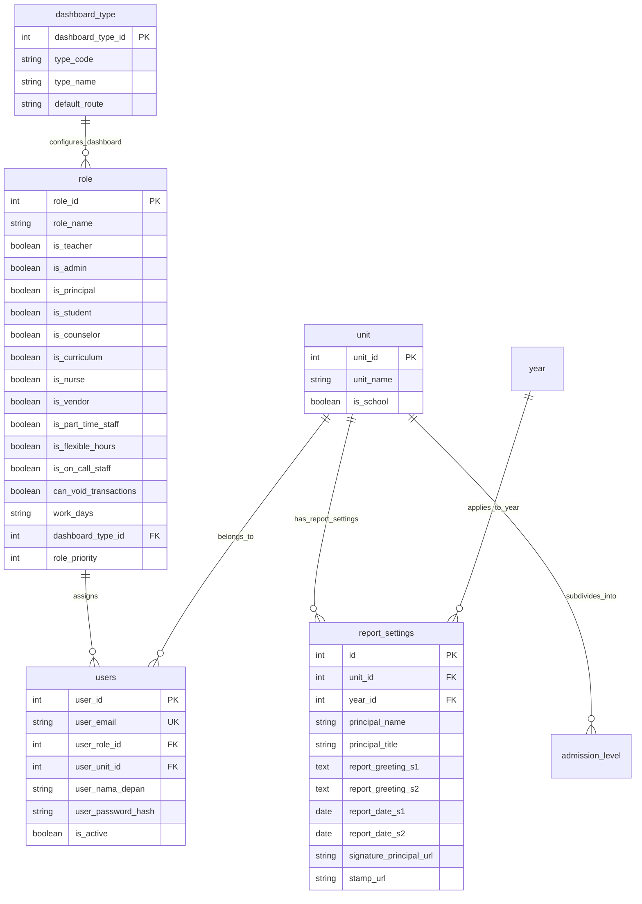
```mermaid
erDiagram
    dashboard_type ||--o{ role : "configures_dashboard"
    role ||--o{ users : "assigns"
    unit ||--o{ users : "belongs_to"
    unit ||--o{ report_settings : "has_report_settings"
    unit ||--o{ admission_level : "subdivides_into"
    year ||--o{ report_settings : "applies_to_year"
    
    dashboard_type {
        int dashboard_type_id PK
        string type_code
        string type_name
        string default_route
    }

    role {
        int role_id PK
        string role_name
        boolean is_teacher
        boolean is_admin
        boolean is_principal
        boolean is_student
        boolean is_counselor
        boolean is_curriculum
        boolean is_nurse
        boolean is_vendor
        boolean is_part_time_staff
        boolean is_flexible_hours
        boolean is_on_call_staff
        boolean can_void_transactions
        string work_days
        int dashboard_type_id FK
        int role_priority
    }
    
    unit {
        int unit_id PK
        string unit_name
        boolean is_school
    }

    report_settings {
        int id PK
        int unit_id FK
        int year_id FK
        string principal_name
        string principal_title
        text report_greeting_s1
        text report_greeting_s2
        date report_date_s1
        date report_date_s2
        string signature_principal_url
        string stamp_url
    }
    
    users {
        int user_id PK
        string user_email UK
        int user_role_id FK
        int user_unit_id FK
        string user_nama_depan
        string user_password_hash
        boolean is_active
    }
```

### 1.3 Tables referencing `users`
Many tables in the system reference `users` for ownership, assignment or action tracking:
- **Academic Setup:** `kelas` (`kelas_user_id` as Wali Kelas 1, `kelas_user_id_2` as Wali Kelas 2 / Co-Teacher for PYP)
- **Subjects:** `subject` (`subject_user_id` as Teacher)
- **Assessments:** `assessment` (`assessment_user_id` as Teacher)
- **Timetable:** `detail_kelas` (`teacher_user_id`), `weekly_overview_draft` (`created_by`) *(Note: `timetable.timetable_user_id` was dropped in favor of single source of truth in `detail_kelas`)*
- **Greeter:** `daftar_door_greeter` (`daftar_door_greeter_user_id`)
- **Attendance:** `attendance`, `attendance_scan_log`
- **Leave/Quota:** `leave_quotas` (`user_id`), `leave_requests` (`user_id`)
- **Purchasing:** `unit_approvers` (`user_id`), `role_approvers` (`user_id`)
- **Admissions & Fees:** `student_applications` (`reviewed_by`), `application_discount` (`created_by`), `application_installment` (`created_by`), `udp_definition` (`created_by`, `updated_by`), `school_fee_definition` (`created_by`, `updated_by`)
- **Logs/Tracking:** Countless tables via `created_by_user_id`

---

## 2. Academic & Class Management Domain (`/data/class`)

This domain handles the core structure for academic years, classes, and assigning students and subjects to these classes.

### 2.1 Tables

#### `year`
Stores the academic years.

| Column Name | Type | Description / Constraint |
| --- | --- | --- |
| `year_id` | `SERIAL` | Primary Key |
| `year_name` | `VARCHAR(50)` | Unique, e.g. "2025/2026" |
| `start_date` | `DATE` | Start date of the academic year |
| `end_date` | `DATE` | End date of the academic year |

#### `kelas`
The main table for classes.

| Column Name | Type | Description / Constraint |
| --- | --- | --- |
| `kelas_id` | `SERIAL` | Primary Key |
| `kelas_nama` | `VARCHAR(50)` | Name of the class (e.g. "7A") |
| `kelas_user_id` | `INTEGER` | FK to `users(user_id)` (Wali Kelas / Homeroom Teacher 1) |
| `kelas_user_id_2` | `INTEGER` | Nullable FK to `users(user_id)` (Wali Kelas 2 / Co-Teacher, optional for PYP units `is_pyp = true`) |
| `kelas_unit_id` | `INTEGER` | FK to `unit(unit_id)` |
| `kelas_year_id` | `INTEGER` | FK to `year(year_id)` |
| `kelas_color_name` | `VARCHAR(20)` | UI badge color ('success', 'warning', 'error') |
| `is_nursery` | `BOOLEAN` | Default `false`, flag for Nursery classes (strictly restricted to PYP unit `is_pyp = true`) |

#### `detail_kelas`
Maps a class to a specific subject, and assigns a teacher who will teach that subject for that class.

| Column Name | Type | Description / Constraint |
| --- | --- | --- |
| `detail_kelas_id` | `SERIAL` | Primary Key |
| `detail_kelas_subject_id` | `INTEGER` | FK to `subject(subject_id)` |
| `detail_kelas_kelas_id` | `INTEGER` | FK to `kelas(kelas_id)` |
| `teacher_user_id` | `INTEGER` | FK to `users(user_id)` (Subject Teacher) |

#### `detail_siswa`
Assigns a student to a specific class.

| Column Name | Type | Description / Constraint |
| --- | --- | --- |
| `detail_siswa_id` | `SERIAL` | Primary Key |
| `detail_siswa_kelas_id` | `INTEGER` | FK to `kelas(kelas_id)` |
| `detail_siswa_user_id` | `INTEGER` | FK to `users(user_id)` (The Student) |

> [!NOTE]
> **Admissions Pipeline Integration:** Prospective students originate from the admissions domain (`student_applications`). Once approved/enrolled, their account is established in `users` (`role.is_student = true`), and they are placed into their designated academic class roster via `detail_siswa`. See **Domain 15: Student Admission & Enrollment Domain** for full details.

#### `class_development_areas`
Parent table storing configured Areas of Development per class (specifically for Nursery classes).

| Column Name | Type | Description / Constraint |
| --- | --- | --- |
| `area_id` | `SERIAL` | Primary Key |
| `kelas_id` | `INTEGER` | FK to `kelas(kelas_id)` ON DELETE CASCADE |
| `area_name` | `VARCHAR(255)` | Area of Development title |
| `sort_order` | `INTEGER` | Ordering integer (default 0) |
| `created_at` | `TIMESTAMPTZ` | Record creation timestamp |
| `updated_at` | `TIMESTAMPTZ` | Record update timestamp |

#### `class_development_criteria`
Child table storing specific evaluation criteria and their Indonesian translations under an Area of Development.

| Column Name | Type | Description / Constraint |
| --- | --- | --- |
| `criteria_id` | `SERIAL` | Primary Key |
| `area_id` | `INTEGER` | FK to `class_development_areas(area_id)` ON DELETE CASCADE |
| `criteria_text` | `TEXT` | Criteria statement in English |
| `criteria_translation` | `TEXT` | Indonesian translation of the criteria |
| `sort_order` | `INTEGER` | Ordering integer (default 0) |
| `created_at` | `TIMESTAMPTZ` | Record creation timestamp |
| `updated_at` | `TIMESTAMPTZ` | Record update timestamp |

#### `nursery_student_progress`
Stores developmental milestone evaluation scores (0 to 3 yellow boxes) for Nursery students per criteria and term (1 to 4).

| Column Name | Type | Description / Constraint |
| --- | --- | --- |
| `progress_id` | `SERIAL` | Primary Key |
| `kelas_id` | `INTEGER` | FK to `kelas(kelas_id)` ON DELETE CASCADE |
| `student_user_id` | `INTEGER` | FK to `users(user_id)` ON DELETE CASCADE |
| `criteria_id` | `INTEGER` | FK to `class_development_criteria(criteria_id)` ON DELETE CASCADE |
| `term` | `INTEGER` | Term number (1, 2, 3, or 4) |
| `score` | `INTEGER` | Score: 0 (Not Assessed), 1 (Beginning), 2 (In Progress), 3 (Achieved) |
| `notes` | `TEXT` | Optional teacher notes for this criteria and term |
| `created_at` | `TIMESTAMPTZ` | Record creation timestamp |
| `updated_at` | `TIMESTAMPTZ` | Record update timestamp |

#### `nursery_student_suggestion`
Stores holistic "Suggestion to move forward" evaluation notes per student per Nursery class, printed on the final page of the Nursery Learning Progression report card.

| Column Name | Type | Description / Constraint |
| --- | --- | --- |
| `suggestion_id` | `SERIAL` | Primary Key |
| `kelas_id` | `INTEGER` | FK to `kelas(kelas_id)` ON DELETE CASCADE |
| `student_user_id` | `INTEGER` | FK to `users(user_id)` ON DELETE CASCADE |
| `suggestion_text` | `TEXT` | Suggestion / developmental recommendation text |
| `created_at` | `TIMESTAMPTZ` | Record creation timestamp |
| `updated_at` | `TIMESTAMPTZ` | Record update timestamp |
| `(kelas_id, student_user_id)` | `UNIQUE` | Unique constraint per student per class |


#### `topic`
Stores IB MYP Unit Planners / Topics created via `/data/topic-new`.

| Column Name | Type | Description / Constraint |
| --- | --- | --- |
| `topic_id` | `SERIAL` | Primary Key |
| `topic_nama` | `VARCHAR` | Title of the unit / topic |
| `topic_subject_id` | `INTEGER` | FK to `subject(subject_id)` |
| `topic_kelas_id` | `INTEGER` | FK to `kelas(kelas_id)` |
| `topic_year` | `INTEGER` | Academic year / MYP Year level |
| `topic_global_context` | `TEXT` | IB MYP Global Context |
| `topic_key_concept` | `TEXT` | IB MYP Key Concept |
| `topic_related_concept` | `TEXT` | IB MYP Related Concept |
| `topic_statement` | `TEXT` | Statement of Inquiry |
| `topic_learner_profile` | `TEXT` | Learner Profile Attributes |
| `topic_service_learning` | `TEXT` | Service as Action / Service Learning |
| `topic_inquiry_question` | `TEXT` | Inquiry Questions (Factual, Conceptual, Debatable) |
| `topic_urutan` | `INTEGER` | Unit sequence number |
| `topic_duration` | `INTEGER` | Unit duration (weeks) |
| `topic_hours_per_week` | `INTEGER` | Teaching hours per week |
| `topic_learning_process` | `TEXT` | Learning Process / Activities |
| `topic_relationship_summative_assessment_statement_of_inquiry` | `TEXT` | Relationship between SA and SOI |
| `topic_resources` | `TEXT` | Learning resources & references |
| `topic_atl` | `TEXT` | Approaches to Learning (ATL) skills |
| `topic_reflection_prior` | `TEXT` | Prior reflection before teaching |
| `topic_reflection_after` | `TEXT` | Reflection after teaching |
| `topic_conceptual_understanding` | `TEXT` | Conceptual understanding statement |
| `topic_gc_exploration` | `TEXT` | Global context exploration |
| `topic_status` | `VARCHAR(20)` | Status of unit planner (`'draft'` or `'published'`). Default `'published'` |


### 2.2 ERD / Relationships (Class Domain)

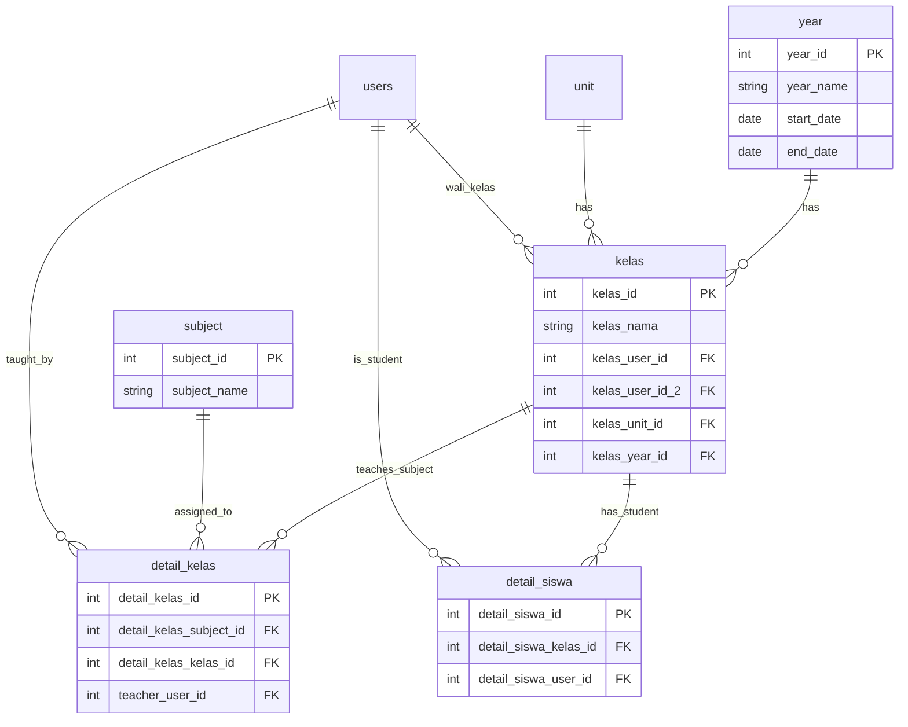
```mermaid
erDiagram
    year ||--o{ kelas : "has"
    unit ||--o{ kelas : "has"
    users ||--o{ kelas : "wali_kelas"
    
    kelas ||--o{ detail_kelas : "teaches_subject"
    subject ||--o{ detail_kelas : "assigned_to"
    users ||--o{ detail_kelas : "taught_by"
    
    kelas ||--o{ detail_siswa : "has_student"
    users ||--o{ detail_siswa : "is_student"
    
    year {
        int year_id PK
        string year_name
        date start_date
        date end_date
    }
    
    kelas {
        int kelas_id PK
        string kelas_nama
        int kelas_user_id FK
        int kelas_user_id_2 FK
        int kelas_unit_id FK
        int kelas_year_id FK
    }
    
    detail_kelas {
        int detail_kelas_id PK
        int detail_kelas_subject_id FK
        int detail_kelas_kelas_id FK
        int teacher_user_id FK
    }
    
    detail_siswa {
        int detail_siswa_id PK
        int detail_siswa_kelas_id FK
        int detail_siswa_user_id FK
    }
    
    subject {
        int subject_id PK
        string subject_name
    }
```

---

## 3. Curriculum & Topics Domain (`/data/topic-new`, `/data/subject`, `/data/subject-group`)

This domain manages the academic curriculum, focusing on subjects, MYP criteria, rubrics, and detailed topics (IB MYP Unit Planners).

> [!CAUTION]
> **No ON DELETE CASCADE.** Foreign key constraints in this domain are **NOT** configured with `ON DELETE CASCADE`. This means the application code **MUST manually delete child records first** before deleting a parent record. The required deletion order is:
> 1. `rubrics` (delete first, FK to `strands`)
> 2. `strands` (delete second, FK to `criteria`)
> 3. `criteria` (delete third, FK to `subject`)
>
> Skipping this order will result in: `violates foreign key constraint "strands_criterion_id_fkey"` or similar errors from Supabase/Postgres.

### 3.1 Tables

#### `subject_group`
Categorizes subjects into standard MYP Groups (e.g., Language Acquisition, Sciences).

| Column Name | Type | Description / Constraint |
| --- | --- | --- |
| `id` | `SERIAL` | Primary Key |
| `name` | `VARCHAR` | Name of the group |

#### `subject`
Represents the subjects taught in the school.

| Column Name | Type | Description / Constraint |
| --- | --- | --- |
| `subject_id` | `SERIAL` | Primary Key |
| `subject_name` | `VARCHAR(100)` | Name of the subject |
| `subject_user_id` | `INTEGER` | FK to `users(user_id)` (Subject Coordinator/Teacher) |
| `subject_unit_id` | `INTEGER` | FK to `unit(unit_id)` |
| `subject_code` | `VARCHAR(30)` | Short code (e.g., MATH7A) |
| `subject_guide` | `TEXT` | URL to subject guide (Google Drive/PDF) |
| `subject_icon` | `TEXT` | URL or class name of the icon |
| `grading_method` | `VARCHAR(20)` | IB MYP grading method: `'highest'`, `'average'`, `'median'`, `'mode'`. Default `'highest'` |
| `core_subject` | `BOOLEAN` | Is this a core subject? |
| `is_community_project` | `BOOLEAN` | Is this a community project? |
| `print_order` | `INTEGER` | Order on printouts/reports |
| `include_in_print` | `BOOLEAN` | Whether to include in report cards |
| `subject_group_id` | `INTEGER` | FK to `subject_group(id)` |
| `custom_grade_boundaries` | `TEXT/JSON` | Custom grade boundaries configuration |

#### `criteria`
Stores IB MYP Assessment Criteria for a subject (e.g., Criterion A, B, C, D).

| Column Name | Type | Description / Constraint |
| --- | --- | --- |
| `criterion_id` | `SERIAL` | Primary Key |
| `subject_id` | `INTEGER` | FK to `subject(subject_id)` |
| `code` | `VARCHAR` | Letter code, e.g. A, B, C, D |
| `name` | `VARCHAR` | Full name, e.g. Knowing and understanding |

#### `strands`
Stores the detailed strands for each criterion across different MYP years.

| Column Name | Type | Description / Constraint |
| --- | --- | --- |
| `strand_id` | `SERIAL` | Primary Key |
| `criterion_id` | `INTEGER` | FK to `criteria(criterion_id)` — **no ON DELETE CASCADE** |
| `year_level` | `INTEGER` | MYP Year (1, 3, 5) |
| `label` | `VARCHAR` | Strand identifier (i, ii, iii) |
| `content` | `TEXT` | The strand description |

#### `rubrics`
Stores the grading rubrics/achievement levels for each strand.

| Column Name | Type | Description / Constraint |
| --- | --- | --- |
| `rubric_id` | `SERIAL` | Primary Key |
| `strand_id` | `INTEGER` | FK to `strands(strand_id)` — **no ON DELETE CASCADE** |
| `band_label` | `VARCHAR` | Level band (e.g., "1-2", "3-4") |
| `min_score` | `INTEGER` | Minimum score for this band |
| `max_score` | `INTEGER` | Maximum score for this band |
| `description` | `TEXT` | Description of achievement at this level |

#### `criterion_descriptors`
Stores MYP year-level task-specific descriptors by subject group and semester.

| Column Name | Type | Description / Constraint |
| --- | --- | --- |
| `id` | `SERIAL` | Primary Key |
| `subject_group_id` | `INTEGER` | FK to `subject_group(id)` |
| `myp_year` | `INTEGER` | MYP Year (e.g., 1, 3, 5) |
| `semester` | `INTEGER` | Semester 1 or 2 |
| `criterion` | `VARCHAR` | A, B, C, or D |
| `band_min` | `INTEGER` | Minimum score bound |
| `band_max` | `INTEGER` | Maximum score bound |
| `descriptor` | `TEXT` | The general descriptor text |

#### `topic`
Represents an IB MYP Unit Planner / Topic. Contains extensive fields for IB MYP planning.

| Column Name | Type | Description / Constraint |
| --- | --- | --- |
| `topic_id` | `SERIAL` | Primary Key |
| `topic_nama` | `VARCHAR(100)` | Unit Title / Topic Name |
| `topic_subject_id` | `INTEGER` | FK to `subject(subject_id)` |
| `topic_kelas_id` | `INTEGER` | FK to `kelas(kelas_id)` |
| `topic_year` | `VARCHAR` | Academic year context |
| `topic_urutan` | `INTEGER` | Ordering / Sequence of the topic |
| `topic_duration` | `INTEGER` | Duration in weeks |
| `topic_hours_per_week` | `INTEGER` | Hours per week |
| `topic_planner` | `TEXT` | URL to external planner |
| `topic_inquiry_question` | `TEXT` | Factual, Conceptual, Debatable questions |
| `topic_global_context` | `TEXT` | IB Global Context |
| `topic_gc_exploration` | `TEXT` | IB Global Context Exploration |
| `topic_key_concept` | `TEXT` | IB Key Concept |
| `topic_related_concept` | `TEXT` | IB Related Concepts |
| `topic_statement` | `TEXT` | Statement of Inquiry |
| `topic_conceptual_understanding` | `TEXT` | Conceptual Understanding |
| `topic_learner_profile` | `TEXT` | Learner Profile Attributes |
| `topic_service_learning` | `TEXT` | Service as action / Service learning |
| `topic_atl` | `TEXT` | Approaches to Learning (ATL) skills |
| `topic_learning_process` | `TEXT` | Learning Process description |
| `topic_formative_assessment` | `TEXT` | Formative assessments |
| `topic_summative_assessment` | `TEXT` | Summative assessments |
| `topic_relationship_summative_assessment_statement_of_inquiry` | `TEXT` | Relationship description |
| `topic_reflection_prior` | `TEXT` | Reflection prior to teaching |
| `topic_reflection_after` | `TEXT` | Reflection after teaching |

### 3.2 ERD / Relationships (Curriculum Domain)

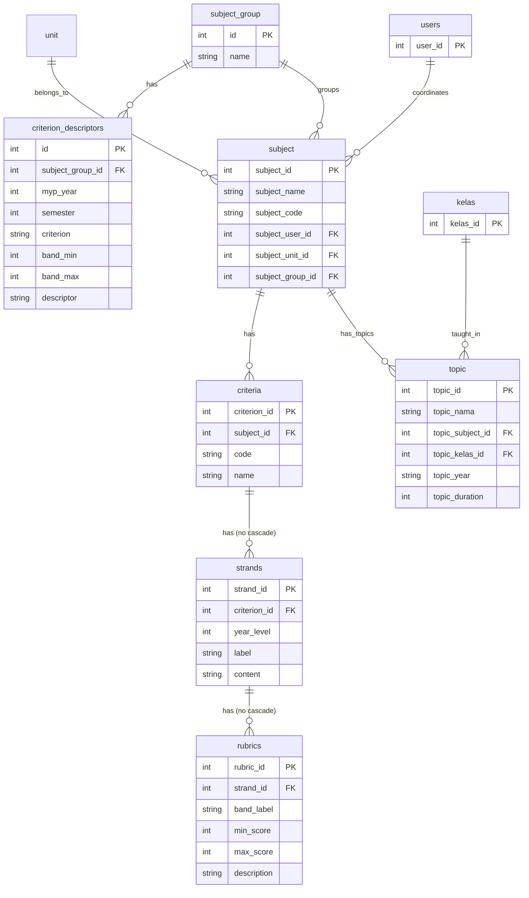
```mermaid
erDiagram
    subject_group ||--o{ subject : "groups"
    subject_group ||--o{ criterion_descriptors : "has"
    subject ||--o{ topic : "has_topics"
    subject ||--o{ criteria : "has"
    criteria ||--o{ strands : "has (no cascade)"
    strands ||--o{ rubrics : "has (no cascade)"
    kelas ||--o{ topic : "taught_in"
    users ||--o{ subject : "coordinates"
    unit ||--o{ subject : "belongs_to"

    subject_group {
        int id PK
        string name
    }

    subject {
        int subject_id PK
        string subject_name
        string subject_code
        int subject_user_id FK
        int subject_unit_id FK
        int subject_group_id FK
    }

    criteria {
        int criterion_id PK
        int subject_id FK
        string code
        string name
    }

    strands {
        int strand_id PK
        int criterion_id FK
        int year_level
        string label
        string content
    }

    rubrics {
        int rubric_id PK
        int strand_id FK
        string band_label
        int min_score
        int max_score
        string description
    }

    criterion_descriptors {
        int id PK
        int subject_group_id FK
        int myp_year
        int semester
        string criterion
        int band_min
        int band_max
        string descriptor
    }

    topic {
        int topic_id PK
        string topic_nama
        int topic_subject_id FK
        int topic_kelas_id FK
        string topic_year
        int topic_duration
    }

    kelas {
        int kelas_id PK
    }

    users {
        int user_id PK
    }
```

---

## 4. Purchasing & Budgeting Domain (/data/fpb)

This domain handles the 'Form Pengajuan Barang' (FPB) or Purchase Request system, tracking requests, line items, and multi-step approvals.

### 4.1 Tables

#### `fpb`
The main header table for a purchase request.

| Column Name | Type | Description / Constraint |
| --- | --- | --- |
| `fpb_id` | `UUID` / `SERIAL` | Primary Key |
| `fpb_number` | `VARCHAR` | Unique identifier/document number |
| `fpb_type_id` | `INTEGER` | FK to `fpb_types` (e.g. General, Special) |
| `division` | `VARCHAR` | Division requesting the items |
| `submitted_by` | `INTEGER` | FK to `users(user_id)` |
| `grand_total` | `DECIMAL` | Total amount of the request |
| `note` | `TEXT` | Additional notes or justification |
| `usage_date` | `DATE` | When the items are needed |
| `status` | `VARCHAR` | `pending`, `approved`, `revision`, `rejected` |
| `current_step` | `INTEGER` | The current approval step |
| `revision_count` | `INTEGER` | Number of times revised |
| `budget` | `NUMERIC` | Assigned budget allocation |
| `remaining_budget` | `NUMERIC` | Remaining budget after request |
| `items_edited_by` | `INTEGER` | FK to `users(user_id)` |
| `items_edited_at` | `TIMESTAMPTZ` | Timestamp when screener edited items |
| `procurement_status` | `VARCHAR` | `'ordered'` (dipesan/dana dicairkan), `'cancelled'` (dibatalkan/tidak jadi dipesan), or `NULL` |
| `procurement_by` | `INTEGER` | FK to `users(user_id)` |
| `procurement_at` | `TIMESTAMPTZ` | Timestamp when marked ordered or cancelled |
| `procurement_note` | `TEXT` | Notes or cancellation reason |
| `created_at` | `TIMESTAMPTZ` | Timestamp created |
| `updated_at` | `TIMESTAMPTZ` | Timestamp last updated |

#### `fpb_items`
The line items requested within an FPB.

| Column Name | Type | Description / Constraint |
| --- | --- | --- |
| `item_id` | `SERIAL` | Primary Key |
| `fpb_id` | `INTEGER` | FK to `fpb(fpb_id)` |
| `item_name` | `VARCHAR` | Name of the requested item |
| `quantity` | `INTEGER` | Quantity requested |
| `unit` | `VARCHAR` | Unit of measurement (pcs, box, etc) |
| `unit_price` | `DECIMAL` | Estimated price per unit |

#### `fpb_approvals`
Tracks the approval state for each required step of an FPB. Each row represents one approver slot within a step.

| Column Name | Type | Description / Constraint |
| --- | --- | --- |
| `approval_id` | `UUID` | Primary Key |
| `fpb_id` | `UUID` | FK to `fpb(fpb_id)` |
| `step_order` | `INTEGER` | Step sequence number (1, 2, 3...) |
| `step_name` | `VARCHAR` | Display name of the step (e.g. "Principal Approval") |
| `approver_order` | `INTEGER` | **Order within a step.** `0` = Screener (role-based, processed first). `1`, `2`, `3` = Regular approvers in display order. |
| `approver_user_id`| `INTEGER` | FK to `users(user_id)`. The specific user who took action. For screener rows (`approver_order=0`), this is `null` initially and populated when the screener actually acts. |
| `approver_role_id`| `INTEGER` | FK to `role(role_id)`. The role authorized to act on this row. |
| `status` | `VARCHAR` | `pending`, `approved`, `revision`, `rejected` |
| `comment` | `TEXT` | Approver's note (required for `revision` and `rejected`) |
| `action_at` | `TIMESTAMP` | When the approval action was taken |

> [!NOTE]
> **Screener row** (`approver_order = 0`): This row is role-based — `approver_user_id` starts as `null`. When the screener takes action, their `user_id` is written to `approver_user_id` so the audit trail shows who specifically performed the screening/rejection.
>
> **No database migration needed** for this behavior — both `approver_order` and `approver_user_id` columns already exist.

#### `fpb_types`
Defines the types of FPB available and their maximum limits.

| Column Name | Type | Description / Constraint |
| --- | --- | --- |
| `id` | `SERIAL` | Primary Key |
| `type_code` | `VARCHAR` | Short code (e.g., KCL, BSR) |
| `type_name` | `VARCHAR` | Full name of the FPB type |
| `max_amount` | `DECIMAL` | Maximum allowed grand total |
| `is_active` | `BOOLEAN` | Whether this type is selectable |

#### `fpb_approval_steps`
Configuration table that defines the default approval routing steps for each FPB type.

#### `fpb_role_approvers`
Maps a specific role to up to 3 specific users who act as approvers on behalf of that role.

| Column Name | Type | Description / Constraint |
| --- | --- | --- |
| `id` | `SERIAL` | Primary Key |
| `role_id` | `INTEGER` | FK to `role(role_id)`, UNIQUE |
| `approver1_id`| `INTEGER` | FK to `users(user_id)` |
| `approver2_id`| `INTEGER` | FK to `users(user_id)` |
| `approver3_id`| `INTEGER` | FK to `users(user_id)` |

#### `fpb_budget_roles`
Defines which roles have the authority to edit budget fields on an FPB.

| Column Name | Type | Description / Constraint |
| --- | --- | --- |
| `id` | `SERIAL` | Primary Key |
| `role_id` | `INTEGER` | FK to `role(role_id)` |

#### `fpb_screener`
Defines the single role that acts as the initial screener (Step 0) for all FPBs.

| Column Name | Type | Description / Constraint |
| --- | --- | --- |
| `id` | `SERIAL` | Primary Key |
| `screener_role_id`| `INTEGER` | FK to `role(role_id)` |

#### `fpb_revisions`
Tracks the history of revision requests (when an approver sends the FPB back).

| Column Name | Type | Description / Constraint |
| --- | --- | --- |
| `id` | `SERIAL` | Primary Key |
| `fpb_id` | `INTEGER` | FK to `fpb(fpb_id)` |
| `revision_number`| `INTEGER` | 1, 2, 3... |
| `revised_by` | `INTEGER` | FK to `users(user_id)` |
| `revision_note`| `TEXT` | Reason for revision |

### 4.2 ERD / Relationships (Purchasing Domain)

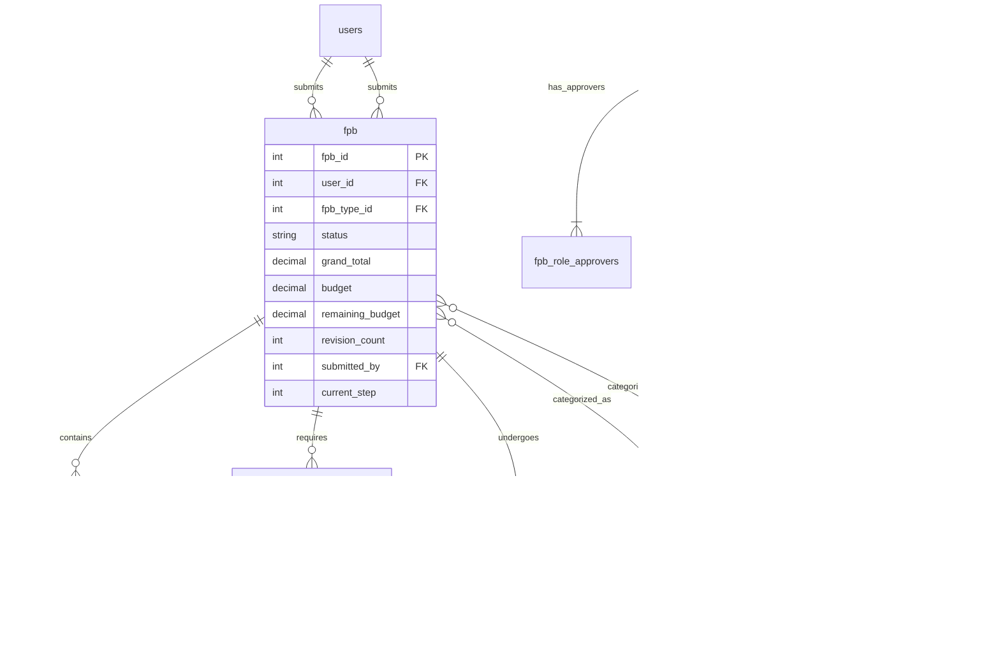
```mermaid
erDiagram
    users ||--o{ fpb : "submits"
    fpb_types ||--o{ fpb : "categorizes"
    fpb ||--o{ fpb_items : "contains"
    fpb ||--o{ fpb_approvals : "requires"
    fpb ||--o{ fpb_revisions : "undergoes"
    fpb }o--|| fpb_types : "categorized_as"
    users ||--o{ fpb : "submits"
    role ||--|{ fpb_role_approvers : "has_approvers"
    role ||--|{ fpb_budget_roles : "can_edit_budget"
    role ||--o{ fpb_screener : "is_screener"

    fpb {
        int fpb_id PK
        int user_id FK
        int fpb_type_id FK
        string status
        decimal grand_total
        decimal budget
        decimal remaining_budget
        int revision_count
        int submitted_by FK
        int current_step
    }
    
    fpb_items {
        int item_id PK
        int fpb_id FK
        string item_name
        int quantity
        decimal unit_price
    }
    
    fpb_approvals {
        int approval_id PK
        int fpb_id FK
        int approver_user_id FK
        int approver_role_id FK
        string status
        int step_order
    }
    
    fpb_types {
        int fpb_type_id PK
        string type_name
    }
```

---

## 5. Attendance & Leave Management Domain (`/data/attendance-settings`, `/data/attendance-leave`, `/data/attendance-form`)

This domain handles the attendance settings, special days, holidays, notifications, leave types, quotas, and approver mappings.

### 5.1 Tables

#### `school_holidays`
Stores global or role-specific school holidays.

| Column Name | Type | Description / Constraint |
| --- | --- | --- |
| `id` | `SERIAL` | Primary Key |
| `name` | `VARCHAR` | Name of the holiday |
| `date_start` | `DATE` | Start date of the holiday |
| `date_end` | `DATE` | End date of the holiday |
| `role_id` | `INTEGER` | FK to `role(role_id)`. Null for global holiday. |
| `date` | `DATE` | Backward compatibility |

#### `special_day_rules`
Stores custom attendance rules for specific dates (e.g., event days) affecting all, a role, or a single user.

| Column Name | Type | Description / Constraint |
| --- | --- | --- |
| `id` | `SERIAL` | Primary Key |
| `tanggal` | `DATE` | Date the rule applies to |
| `scope_type` | `VARCHAR` | Scope: `all`, `role`, or `user` |
| `role_id` | `INTEGER` | FK to `role(role_id)` (if scope_type is `role`) |
| `user_id` | `INTEGER` | FK to `users(user_id)` (if scope_type is `user`) |
| `is_work_day` | `BOOLEAN` | Indicates if this day requires attendance |
| `custom_check_in` | `TIME` | Overrides default check-in time |
| `custom_check_out`| `TIME` | Overrides default check-out time |
| `keterangan` | `TEXT` | Notes |
| `created_at` | `TIMESTAMP`| Record creation time |

#### `attendances`
Stores the raw machine scan logs. Note: Check-in vs check-out is determined dynamically: First scan of the day = Check-In, Last scan of the day = Check-Out (with a 5-minute debounce guardrail to prevent accidental double-scans upon arrival). Single-scan days use midpoint logic (<= 12:00 = Check-In, > 12:00 = Check-Out). `status_scan` from machine is not relied upon.

| Column Name | Type | Description / Constraint |
| --- | --- | --- |
| `id` | `SERIAL` | Primary Key |
| `user_id` | `INTEGER` | FK to `users(user_id)` |
| `scan_time` | `TIMESTAMPTZ`| When the user scanned |
| `status_scan` | `VARCHAR` | Check-in or check-out (not fully reliable) |
| `raw_payload` | `JSONB` | Full JSON payload received from the attendance machine / webhook |
| `created_at` | `TIMESTAMPTZ`| Record creation timestamp |

#### `attendance_excuses`
Stores excuse forms (surat keterangan) for attendance anomalies (late, absent, etc).

| Column Name | Type | Description / Constraint |
| --- | --- | --- |
| `id` | `SERIAL` | Primary Key |
| `user_id` | `INTEGER` | FK to `users(user_id)` (The submitter) |
| `excuse_type` | `VARCHAR` | `late`, `leave_early`, `absent`, `no_checkin`, `no_checkout` |
| `attendance_date`| `DATE` | The date of the anomaly |
| `late_minutes` | `INTEGER` | Minutes late (if applicable) |
| `category` | `VARCHAR` | Reason category (e.g. sick, annual_leave) |
| `other_reason` | `TEXT` | Additional explanation |
| `attachment_url` | `TEXT` | URL to attached proof |
| `status` | `VARCHAR` | `pending`, `approved_1`, `approved`, `rejected` |
| `approver1_id` | `INTEGER` | FK to `users(user_id)` |
| `approver2_id` | `INTEGER` | FK to `users(user_id)` |
| `approver1_action`| `VARCHAR` | `approved` or `rejected` |
| `approver1_note` | `TEXT` | Note from approver 1 |
| `approver1_at` | `TIMESTAMP`| Action timestamp |
| `approver2_action`| `VARCHAR` | `approved` or `rejected` |
| `approver2_note` | `TEXT` | Note from approver 2 |
| `approver2_at` | `TIMESTAMP`| Action timestamp |

#### `user_position_history`
Tracks the position title of a user over time for reporting.

| Column Name | Type | Description / Constraint |
| --- | --- | --- |
| `id` | `SERIAL` | Primary Key |
| `user_id` | `INTEGER` | FK to `users(user_id)` |
| `position_title` | `VARCHAR` | Title of the position |
| `start_date` | `DATE` | When the position started |
| `end_date` | `DATE` | When the position ended (null if active) |

#### `role_approvers`
Maps roles to their specific approvers (used for leave/attendance requests).

| Column Name | Type | Description / Constraint |
| --- | --- | --- |
| `role_id` | `INTEGER` | Primary Key, FK to `role(role_id)` |
| `approver1_id` | `INTEGER` | FK to `users(user_id)` (First approver) |
| `approver2_id` | `INTEGER` | FK to `users(user_id)` (Second approver, optional) |

#### `settings`
Global configuration key-value store.

| Column Name | Type | Description / Constraint |
| --- | --- | --- |
| `key` | `VARCHAR` | Primary Key (e.g., `attendance_notif_admin_emails`) |
| `value` | `TEXT` | Value of the setting |

#### `attendance_notification_log`
Tracks attendance violation emails and Google Chat DMs sent to users.

| Column Name | Type | Description / Constraint |
| --- | --- | --- |
| `id` | `SERIAL` | Primary Key |
| `user_id` | `INTEGER` | FK to `users(user_id)` |
| `notif_date` | `DATE` | Target date of the attendance issue |
| `notif_type` | `VARCHAR` | E.g., `late`, `leave_early`, `no_checkin`, `no_checkout` |
| `minutes_diff` | `INTEGER` | Minutes late or early |
| `scheduled_time`| `TIME` | Expected time |
| `actual_time` | `TIME` | Actual scan time |
| `email_to` | `JSON/ARRAY`| Email recipient(s) |
| `success` | `BOOLEAN` | True if sent successfully, null if skipped |
| `sent_at` | `TIMESTAMP`| When the notification was sent |

#### `attendance_notify_run_log`
Tracks the daily run of the cron job that processes attendance emails and Google Chat DMs.

| Column Name | Type | Description / Constraint |
| --- | --- | --- |
| `id` | `SERIAL` | Primary Key |
| `ran_at` | `TIMESTAMP`| Default to now() |
| `target_date` | `DATE` | The date being processed (usually yesterday) |
| `users_processed` | `INTEGER` | Number of users analyzed |
| `violations_found`| `INTEGER` | Total issues found |
| `emails_sent` | `INTEGER` | Total notifications (Email/Chat) sent |
| `emails_failed` | `INTEGER` | Total notifications failed |
| `admin_emails` | `JSON/ARRAY`| Admin email recipients |
| `admin_email_ok`| `BOOLEAN` | Success status of admin summary |
| `error_message` | `TEXT` | Any error during run |

#### `leave_types`
Master data for leave/excuse types (sick, annual leave, etc.), defining rules for each type.

| Column Name | Type | Description / Constraint |
| --- | --- | --- |
| `id` | `SERIAL` | Primary Key |
| `code` | `VARCHAR(50)`| Unique, code identifier (e.g., `annual_leave`) |
| `name_id` | `TEXT` | Indonesian name |
| `name_en` | `TEXT` | English name |
| `issue_types` | `TEXT[]` | Contexts (e.g., `{late, absent}`) |
| `max_days` | `INTEGER` | Max days allowed, NULL if unlimited |
| `requires_upload`| `BOOLEAN` | If true, user must upload a file (e.g., doctor's note) |
| `deduct_quota` | `BOOLEAN` | If true, deducts from `leave_quotas` |
| `is_paid` | `BOOLEAN` | Paid vs unpaid leave |

#### `leave_quotas`
Tracks the annual leave balance for users for specific leave types.

| Column Name | Type | Description / Constraint |
| --- | --- | --- |
| `id` | `SERIAL` | Primary Key |
| `user_id` | `INTEGER` | FK to `users(user_id)` ON DELETE CASCADE |
| `leave_type_code`| `VARCHAR(50)`| FK to `leave_types(code)` |
| `year` | `INTEGER` | The year this quota applies to |
| `total_days` | `INTEGER` | Total allocation for the year |
| `used_days` | `INTEGER` | Days already consumed |

#### `kelas_attendance`
Stores daily student attendance recorded by teachers/homeroom mentors per class per date.

| Column Name | Type | Description / Constraint |
| --- | --- | --- |
| `id` | `BIGINT` | Primary Key (Identity) |
| `kelas_id` | `INTEGER` | FK to `kelas(kelas_id)` ON DELETE CASCADE |
| `detail_siswa_id` | `INTEGER` | FK to `detail_siswa(detail_siswa_id)` ON DELETE CASCADE |
| `tanggal` | `DATE` | Date of attendance (YYYY-MM-DD) |
| `status` | `VARCHAR` | Status: `hadir`, `tidak_hadir`, `ijin`, `sakit`, `terlambat`, `pulang_cepat` |
| `keterangan` | `TEXT` | Optional notes / details |
| `created_by` | `BIGINT` | FK to `users(user_id)` (Teacher/Mentor who recorded) |
| `created_at` | `TIMESTAMPTZ`| Record creation timestamp |
| `CONSTRAINT` | `UNIQUE` | `(detail_siswa_id, tanggal)` |

### 5.2 ERD / Relationships (Attendance Domain)

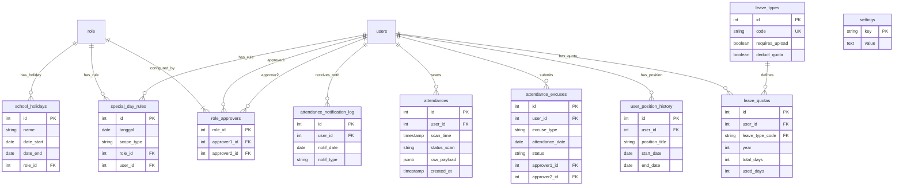
```mermaid
erDiagram
    role ||--o{ school_holidays : "has_holiday"
    role ||--o{ special_day_rules : "has_rule"
    users ||--o{ special_day_rules : "has_rule"
    role ||--|{ role_approvers : "configured_by"
    users ||--o{ role_approvers : "approver1"
    users ||--o{ role_approvers : "approver2"
    users ||--o{ attendance_notification_log : "receives_notif"
    users ||--o{ attendances : "scans"
    users ||--o{ attendance_excuses : "submits"
    users ||--o{ user_position_history : "has_position"
    users ||--o{ leave_quotas : "has_quota"
    leave_types ||--o{ leave_quotas : "defines"

    school_holidays {
        int id PK
        string name
        date date_start
        date date_end
        int role_id FK
    }

    special_day_rules {
        int id PK
        date tanggal
        string scope_type
        int role_id FK
        int user_id FK
    }

    attendances {
        int id PK
        int user_id FK
        timestamp scan_time
        string status_scan
        jsonb raw_payload
        timestamp created_at
    }

    attendance_excuses {
        int id PK
        int user_id FK
        string excuse_type
        date attendance_date
        string status
        int approver1_id FK
        int approver2_id FK
    }

    user_position_history {
        int id PK
        int user_id FK
        string position_title
        date start_date
        date end_date
    }

    role_approvers {
        int role_id PK
        int approver1_id FK
        int approver2_id FK
    }

    settings {
        string key PK
        text value
    }

    attendance_notification_log {
        int id PK
        int user_id FK
        date notif_date
        string notif_type
    }

    leave_types {
        int id PK
        string code UK
        boolean requires_upload
        boolean deduct_quota
    }

    leave_quotas {
        int id PK
        int user_id FK
        string leave_type_code FK
        int year
        int total_days
        int used_days
    }
```

---

## 6. Assessment & Grading Domain (`/data/topic-new` / Reports)

This domain handles the IB MYP grading system, storing the grades given by teachers to students based on assessments and criteria strands.

### 6.1 Tables

#### `assessment_grades`
Stores the final summarized grades for a student per assessment, including criterion grades (A-D) and the final MYP grade.

| Column Name | Type | Description / Constraint |
| --- | --- | --- |
| `grade_id` | `BIGSERIAL` | Primary Key |
| `assessment_id` | `INTEGER` | FK to `assessment(assessment_id)` ON DELETE CASCADE |
| `detail_siswa_id` | `INTEGER` | FK to `detail_siswa(detail_siswa_id)` ON DELETE CASCADE |
| `criterion_a_grade` | `SMALLINT` | 0-8 scale (Highest strand grade for Criterion A) |
| `criterion_b_grade` | `SMALLINT` | 0-8 scale (Highest strand grade for Criterion B) |
| `criterion_c_grade` | `SMALLINT` | 0-8 scale (Highest strand grade for Criterion C) |
| `criterion_d_grade` | `SMALLINT` | 0-8 scale (Highest strand grade for Criterion D) |
| `final_grade` | `SMALLINT` | 1-7 scale (Based on sum of criteria A-D) |
| `comments` | `TEXT` | Teacher's comments |
| `created_by_user_id` | `INTEGER` | FK to `users(user_id)` |
| `updated_by_user_id` | `INTEGER` | FK to `users(user_id)` |

> [!NOTE]
> **Calculation Rules:**
> - **Criterion Grade:** Uses "best-fit" approach, calculated as the **highest** strand grade within that criterion (`Math.max(...strand_grades)`).
> - **Final Grade:** Sum of all 4 criteria (max 32). Converted to 1-7 scale: 1-5 (1), 6-9 (2), 10-14 (3), 15-18 (4), 19-23 (5), 24-27 (6), 28-32 (7).

#### `assessment_grade_strands`
Stores the detailed score (0-8) for each specific strand (i, ii, iii, iv) for a student in an assessment.

| Column Name | Type | Description / Constraint |
| --- | --- | --- |
| `grade_strand_id` | `BIGSERIAL` | Primary Key |
| `grade_id` | `BIGINT` | FK to `assessment_grades(grade_id)` ON DELETE CASCADE |
| `strand_id` | `BIGINT` | FK to `strands(strand_id)` ON DELETE CASCADE |
| `strand_grade` | `SMALLINT` | Grade for this specific strand (0-8 scale) |
| `notes` | `TEXT` | Additional notes for this strand |

### 6.2 ERD / Relationships (Assessment & Grading)

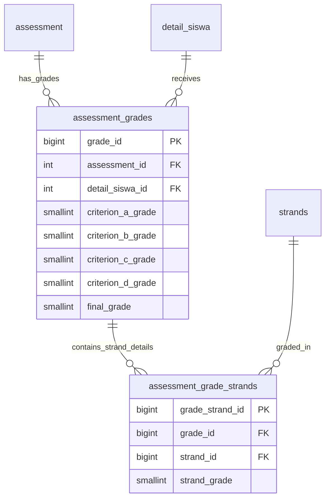
```mermaid
erDiagram
    assessment ||--o{ assessment_grades : "has_grades"
    detail_siswa ||--o{ assessment_grades : "receives"
    assessment_grades ||--o{ assessment_grade_strands : "contains_strand_details"
    strands ||--o{ assessment_grade_strands : "graded_in"

    assessment_grades {
        bigint grade_id PK
        int assessment_id FK
        int detail_siswa_id FK
        smallint criterion_a_grade
        smallint criterion_b_grade
        smallint criterion_c_grade
        smallint criterion_d_grade
        smallint final_grade
    }

    assessment_grade_strands {
        bigint grade_strand_id PK
        bigint grade_id FK
        bigint strand_id FK
        smallint strand_grade
    }
```

---

## 7. Menu & Role Permissions Domain (`/data/menu_management`)

This domain handles the dynamic sidebar menus and dashboard cards, as well as the role-based access control (RBAC) linking which roles can access which menus.

### 7.1 Tables

#### `menus`
Stores the hierarchical structure of the application menus.

| Column Name | Type | Description / Constraint |
| --- | --- | --- |
| `menu_id` | `SERIAL` | Primary Key |
| `menu_name` | `VARCHAR` | Display name of the menu |
| `menu_path` | `VARCHAR` | URL path for navigation (e.g., `/data/class`) |
| `menu_icon` | `VARCHAR` | FontAwesome icon class (e.g., `fas fa-table`) |
| `menu_order` | `INTEGER` | Sorting order for display |
| `menu_parent_id` | `INTEGER` | FK to `menus(menu_id)` for submenus (nullable) |
| `menu_show_dashboard`| `BOOLEAN` | If true, this menu also appears as a card on the dashboard |

#### `menu_permissions`
Junction table that maps which roles have access to which menus.

| Column Name | Type | Description / Constraint |
| --- | --- | --- |
| `menu_id` | `INTEGER` | FK to `menus(menu_id)` |
| `role_id` | `INTEGER` | FK to `role(role_id)` |
| `(menu_id, role_id)` | `PK/UNIQUE`| Composite Constraint |

> [!NOTE]
> Admins (users where `role.is_admin` is true) implicitly have access to all menus regardless of entries in the `menu_permissions` table.

### 7.2 ERD / Relationships (Menu Domain)

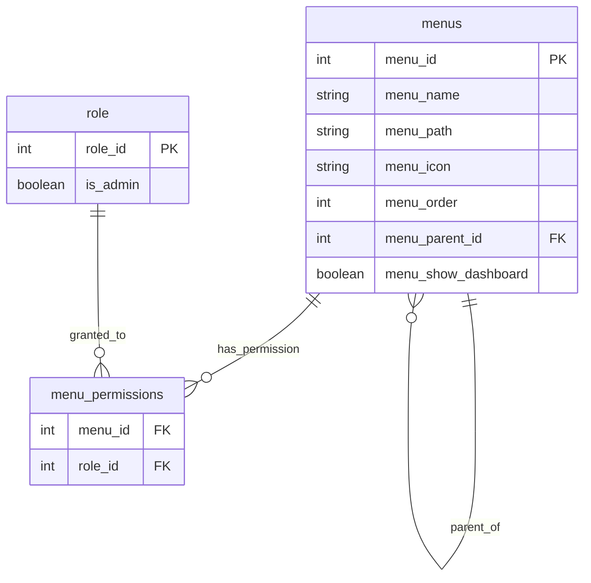
```mermaid
erDiagram
    menus ||--o{ menus : "parent_of"
    menus ||--o{ menu_permissions : "has_permission"
    role ||--o{ menu_permissions : "granted_to"

    menus {
        int menu_id PK
        string menu_name
        string menu_path
        string menu_icon
        int menu_order
        int menu_parent_id FK
        boolean menu_show_dashboard
    }

    menu_permissions {
        int menu_id FK
        int role_id FK
    }

    role {
        int role_id PK
        boolean is_admin
    }
```

---

## 8. Room & Booking Management Domain (`/data/room`, `/room/booking`)

This domain manages the physical rooms within the school and allows staff to reserve time slots for these rooms, ensuring there are no overlapping bookings.

### 8.1 Tables

#### `room`
Stores the master data for physical rooms or facilities available for booking.

| Column Name | Type | Description / Constraint |
| --- | --- | --- |
| `room_id` | `SERIAL` | Primary Key |
| `room_name` | `VARCHAR(100)` | Name of the room (Unique) |
| `created_at` | `TIMESTAMP` | Record creation time |
| `updated_at` | `TIMESTAMP` | Record update time |

#### `room_booking`
Records reservations for rooms by users.

| Column Name | Type | Description / Constraint |
| --- | --- | --- |
| `booking_id` | `SERIAL` | Primary Key |
| `room_id` | `INTEGER` | FK to `room(room_id)` |
| `requested_by_user_id`| `INTEGER` | FK to `users(user_id)` |
| `booking_time` | `TSTZRANGE` | PostgreSQL timestamp range indicating the start and end of the booking slot |
| `purpose` | `TEXT` | The purpose or reason for the booking |
| `status` | `VARCHAR` | Current status (e.g., `approved`, `cancelled`) |
| `created_at` | `TIMESTAMP` | When the booking was created |

#### `room_blocks`
Records administrative blocks to prevent room bookings on specific dates or recurring days.

| Column Name | Type | Description / Constraint |
| --- | --- | --- |
| `id` | `SERIAL` | Primary Key |
| `room_id` | `INTEGER` | FK to `room(room_id)` |
| `day_of_week` | `INTEGER` | 0=Sun, 1=Mon...6=Sat (NULL if specific date) |
| `specific_date` | `DATE` | Specific date for the block (NULL if recurring day) |
| `recurring_from`| `DATE` | For recurring blocks, they only apply starting from this date (Optional) |
| `recurring_until`| `DATE` | For recurring blocks, they stop applying after this date (Optional) |
| `start_time` | `TIME` | Start time of the block |
| `end_time` | `TIME` | End time of the block |
| `reason` | `TEXT` | Reason for the block (e.g. Maintenance) |

> [!NOTE]
> **Overlap Prevention:** The `room_booking.booking_time` column uses a PostgreSQL `TSTZRANGE` type. Overlaps are prevented by checking existing bookings with an `approved` status, as well as checking against `room_blocks` (both specific dates and recurring days).

### 8.2 ERD / Relationships (Room Booking)

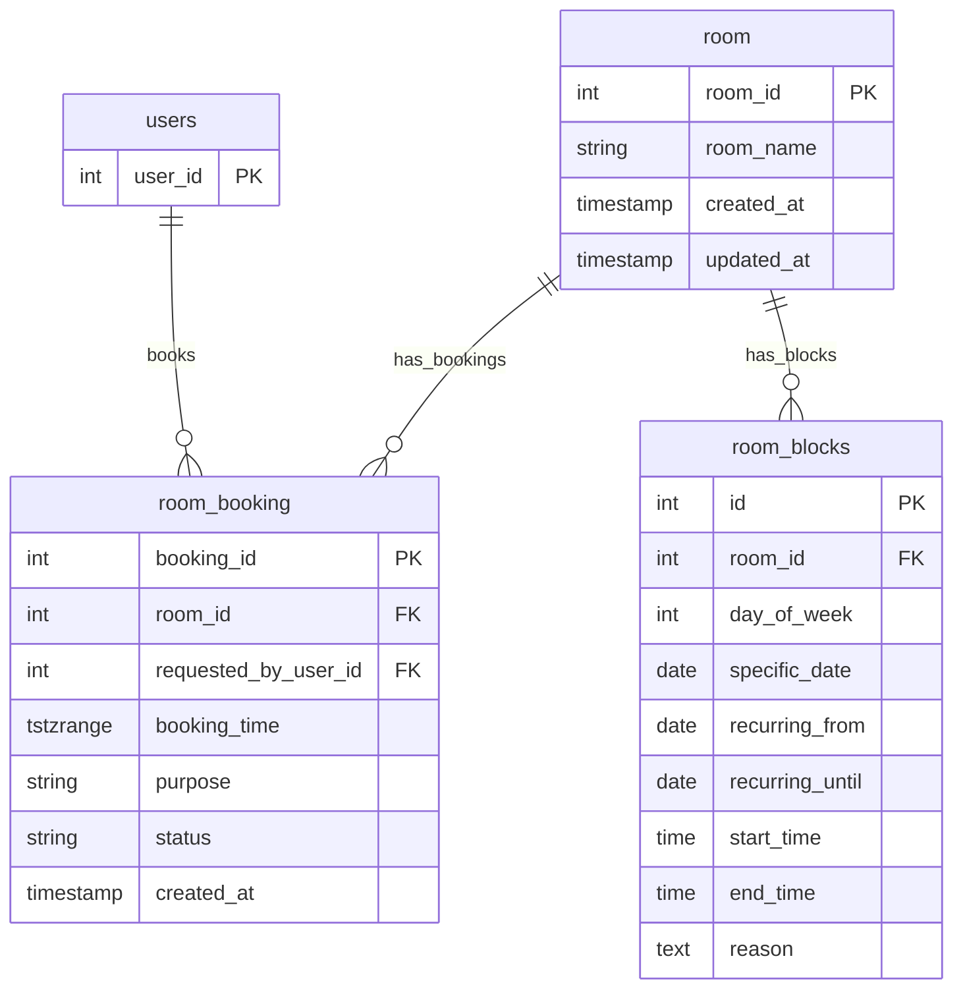
```mermaid
erDiagram
    room ||--o{ room_booking : "has_bookings"
    room ||--o{ room_blocks : "has_blocks"
    users ||--o{ room_booking : "books"

    room {
        int room_id PK
        string room_name
        timestamp created_at
        timestamp updated_at
    }

    room_blocks {
        int id PK
        int room_id FK
        int day_of_week
        date specific_date
        date recurring_from
        date recurring_until
        time start_time
        time end_time
        text reason
    }

    room_booking {
        int booking_id PK
        int room_id FK
        int requested_by_user_id FK
        tstzrange booking_time
        string purpose
        string status
        timestamp created_at
    }

    users {
        int user_id PK
    }
```

---

## 9. Timetable & Schedule Management Domain (`/data/timetable`, `/data/weekly-overview`)

This domain handles weekly recurring lesson schedules, schedule exceptions (holidays, special events), topic weekly plans, and weekly overview drafts.

### 9.1 Tables

#### `timetable`
Stores the weekly recurring lesson and custom label schedules (e.g., BREAK, Morning Devotion).

| Column Name | Type | Description / Constraint |
| --- | --- | --- |
| `timetable_id` | `SERIAL` | Primary Key |
| `timetable_detail_kelas_id` | `INTEGER` | Nullable. Foreign Key to `detail_kelas(detail_kelas_id)` |
| `timetable_day` | `TEXT` | Day of week (`Monday`..`Friday`) |
| `timetable_time` | `TSRANGE` | Time range of the block |
| `custom_label` | `VARCHAR(255)` | Optional custom label (e.g., `BREAK`, `Morning Devotion`, `Assembly`) |
| `custom_color` | `VARCHAR(50)` | Optional cell fill color in hex (e.g., `FEF08A`, `DCFCE7`, `F3E8FF`) |
| `kelas_id` | `INTEGER` | Foreign Key to `kelas(kelas_id)` ON DELETE CASCADE (used for custom slots) |

> [!NOTE]
> `timetable_user_id` column existed previously but was dropped during migration (`timetable_user_id` dropped). Teacher is derived dynamically from `detail_kelas.teacher_user_id` (single source of truth).

#### `timetable_exception`
Stores per-date schedule overrides such as school holidays or special events (e.g., Kebaktian, sports day).

| Column Name | Type | Description / Constraint |
| --- | --- | --- |
| `exception_id` | `SERIAL` | Primary Key |
| `exception_date` | `DATE` | The specific date for the exception |
| `exception_label` | `TEXT` | Label/Name (e.g., "Libur Hari Raya", "Kebaktian") |
| `exception_type` | `TEXT` | Exception type: `'holiday'` (full-day) or `'event'` (time range override) |
| `start_time` | `TIME` | Optional start time (for `'event'` type) |
| `end_time` | `TIME` | Optional end time (for `'event'` type) |
| `affects_all_kelas` | `BOOLEAN` | Default `true`. If `false`, applies only to specified `affected_kelas_ids` |
| `affected_kelas_ids` | `INT[]` | Array of `kelas_id` affected when `affects_all_kelas` is `false` (restricted to MYP classes where `unit.is_myp = true`) |
| `note` | `TEXT` | Optional notes |
| `created_at` | `TIMESTAMPTZ` | Default `now()` |

#### `topic_weekly_plan`
Stores the weekly breakdown of unit plans/topics for a specific week number and date range.

| Column Name | Type | Description / Constraint |
| --- | --- | --- |
| `id` | `SERIAL` | Primary Key |
| `topic_id` | `INTEGER` | Foreign Key to `topic(topic_id)` ON DELETE CASCADE |
| `week_number` | `INTEGER` | Week sequence number (1..topic_duration) |
| `week_date` | `DATE` | Any date within the week this plan applies to |
| `week_objectives` | `TEXT` | Weekly learning objectives |
| `week_activities` | `TEXT` | Weekly learning activities |
| `week_resources` | `TEXT` | Weekly learning resources |
| `week_reflection` | `TEXT` | Weekly reflection |
| `updated_at` | `TIMESTAMPTZ` | Last update timestamp |
| `(topic_id, week_number)` | `UNIQUE` | Unique constraint per topic and week number |

#### `weekly_overview_draft`
Stores saved drafts of the Weekly Overview grid per class and week date.

| Column Name | Type | Description / Constraint |
| --- | --- | --- |
| `draft_id` | `SERIAL` | Primary Key |
| `kelas_id` | `INTEGER` | Foreign Key to `kelas(kelas_id)` ON DELETE CASCADE |
| `week_date` | `DATE` | Monday of the selected week |
| `draft_data` | `JSONB` | Serialized overview grid state (`{cells, kelasNama, weekLabel}`) |
| `created_by` | `INTEGER` | Foreign Key to `users(user_id)` |
| `created_at` | `TIMESTAMPTZ` | Record creation time |
| `updated_at` | `TIMESTAMPTZ` | Record update time |
| `(kelas_id, week_date)` | `UNIQUE` | Unique constraint per class and week date |

### 9.2 ERD / Relationships (Timetable & Schedule Domain)

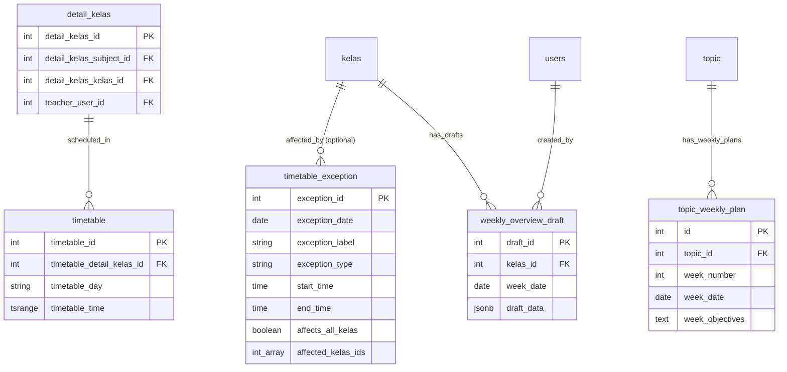
```mermaid
erDiagram
    detail_kelas ||--o{ timetable : "scheduled_in"
    kelas ||--o{ timetable_exception : "affected_by (optional)"
    topic ||--o{ topic_weekly_plan : "has_weekly_plans"
    kelas ||--o{ weekly_overview_draft : "has_drafts"
    users ||--o{ weekly_overview_draft : "created_by"

    detail_kelas {
        int detail_kelas_id PK
        int detail_kelas_subject_id FK
        int detail_kelas_kelas_id FK
        int teacher_user_id FK
    }

    timetable {
        int timetable_id PK
        int timetable_detail_kelas_id FK
        string timetable_day
        tsrange timetable_time
    }

    timetable_exception {
        int exception_id PK
        date exception_date
        string exception_label
        string exception_type
        time start_time
        time end_time
        boolean affects_all_kelas
        int_array affected_kelas_ids
    }

    topic_weekly_plan {
        int id PK
        int topic_id FK
        int week_number
        date week_date
        text week_objectives
    }

    weekly_overview_draft {
        int draft_id PK
        int kelas_id FK
        date week_date
        jsonb draft_data
    }
```

---

## 10. Duty, Greeter & Devotion Schedule Domain (`/data/door_greeter`)

This domain handles the daily teacher duty roster, morning devotion leaders, prayer subjects (teachers & students to be prayed for), morning door greeters, and break/lunch duty assignments scoped per academic year (`year_id`).

### 10.1 Tables

#### `duty_schedules`
Stores the daily duty roster and devotion schedule for each academic date within an academic year.

| Column Name | Type | Description / Constraint |
| --- | --- | --- |
| `id` | `SERIAL` | Primary Key |
| `year_id` | `INTEGER` | Foreign Key to `year(year_id)` ON DELETE CASCADE |
| `duty_date` | `DATE` | Specific date for the duty schedule |
| `devotion_leader_user_id` | `INTEGER` | FK to `users(user_id)` (Devotion Leader) |
| `teacher_to_be_prayed` | `VARCHAR(255)` | Plain text for Teacher(s) to Be Prayed For |
| `student_to_be_prayed` | `VARCHAR(255)` | Plain text for Student(s) to Be Prayed For |
| `greeter_1st_floor_user_id` | `INTEGER` | FK to `users(user_id)` (Morning Greeter 1st Floor, 07:30–08:00) |
| `greeter_2nd_floor_user_id` | `INTEGER` | FK to `users(user_id)` (Morning Greeter 2nd Floor, 07:30–08:00) |
| `break_canteen_user_id` | `INTEGER` | FK to `users(user_id)` (Break Duty Canteen, 09:45–10:15) |
| `break_pe_field_user_id` | `INTEGER` | FK to `users(user_id)` (Break Duty PE Field, 09:45–10:15) |
| `break_2nd_floor_user_id` | `INTEGER` | FK to `users(user_id)` (Break Duty 2nd Floor, 09:45–10:15) |
| `break_3rd_floor_user_id` | `INTEGER` | FK to `users(user_id)` (Break Duty 3rd Floor, 09:45–10:15) |
| `lunch_canteen_user_id` | `INTEGER` | FK to `users(user_id)` (Lunch Duty Canteen) |
| `lunch_pe_field_user_id` | `INTEGER` | FK to `users(user_id)` (Lunch Duty PE Field) |
| `lunch_2nd_floor_user_id` | `INTEGER` | FK to `users(user_id)` (Lunch Duty 2nd Floor) |
| `lunch_3rd_floor_user_id` | `INTEGER` | FK to `users(user_id)` (Lunch Duty 3rd Floor) |
| `note` | `TEXT` | Optional notes |
| `created_at` | `TIMESTAMPTZ` | Record creation timestamp |
| `updated_at` | `TIMESTAMPTZ` | Record update timestamp |
| `(year_id, duty_date)` | `UNIQUE` | Unique constraint per academic year and duty date |

> [!NOTE]
> **Legacy Table:** Previously, door greeter assignments were stored in `daftar_door_greeter` (which only stored user_id and day_of_week without date or academic year context). `duty_schedules` replaces/upgrades `daftar_door_greeter` to support date-specific schedules, academic year filtering, devotion leaders, prayer subjects, and multiple duty slots.

#### `duty_settings`
Master configuration table for duty times and Google Chat reminder offsets. Allows dynamic configuration of duty slot operational hours.

| Column Name | Type | Description / Constraint |
| --- | --- | --- |
| `id` | `SERIAL` | Primary Key |
| `slot_key` | `VARCHAR(50)` | Short code (`devotion`, `greeter`, `break`, `lunch`), UNIQUE |
| `slot_name` | `VARCHAR(100)` | Display name (e.g. "Morning Devotion Leader", "Lunch Duty") |
| `start_time` | `TIME` | Scheduled start time (e.g. `07:30:00`, `09:45:00`, `12:30:00`) |
| `end_time` | `TIME` | Scheduled end time (e.g. `08:00:00`, `10:15:00`, `13:00:00`) |
| `reminder_minutes_before` | `INTEGER` | Google Chat reminder offset in minutes (Default: 60 minutes = 1 hour) |
| `created_at` | `TIMESTAMPTZ` | Record creation timestamp |
| `updated_at` | `TIMESTAMPTZ` | Record update timestamp |

### 10.2 ERD / Relationships (Duty & Devotion Schedule Domain)

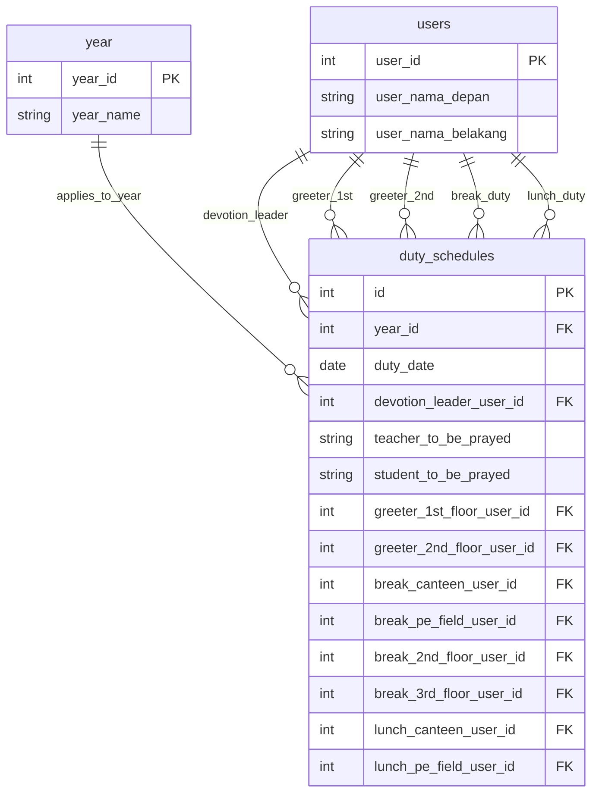
```mermaid
erDiagram
    year ||--o{ duty_schedules : "applies_to_year"
    users ||--o{ duty_schedules : "devotion_leader"
    users ||--o{ duty_schedules : "greeter_1st"
    users ||--o{ duty_schedules : "greeter_2nd"
    users ||--o{ duty_schedules : "break_duty"
    users ||--o{ duty_schedules : "lunch_duty"

    year {
        int year_id PK
        string year_name
    }

    users {
        int user_id PK
        string user_nama_depan
        string user_nama_belakang
    }

    duty_schedules {
        int id PK
        int year_id FK
        date duty_date
        int devotion_leader_user_id FK
        string teacher_to_be_prayed
        string student_to_be_prayed
        int greeter_1st_floor_user_id FK
        int greeter_2nd_floor_user_id FK
        int break_canteen_user_id FK
        int break_pe_field_user_id FK
        int break_2nd_floor_user_id FK
        int break_3rd_floor_user_id FK
        int lunch_canteen_user_id FK
        int lunch_pe_field_user_id FK
    }
```

## 11. Uniform & Stock Management Domain (`/sales/uniform`, `/stock/uniform/add`, `/stock/uniform/initial`, `/stock/uniform/po-settings`, `/data/uniform`, `/data/uniform-size`)

This domain manages uniform catalog master data (`/data/uniform`), size master data (`/data/uniform-size`), pricing/HPP variants (`uniform_variant`), unit assignments (`uniform_unit`), initial stock setup & stock movement ledger (`/stock/uniform/initial`), supplier procurement (PO & Goods Receipts under `/stock/uniform/add` and `/stock/uniform/po-settings`), student sales transactions (`/sales/uniform`), and multi-supplier inventory stock balance calculations.

### 11.1 Tables

#### `uniform`
Master table for uniform items catalog.

| Column Name | Type | Description / Constraint |
| --- | --- | --- |
| `uniform_id` | `SERIAL` | Primary Key |
| `unit_id` | `INTEGER` | FK to `unit(unit_id)` (Legacy column, replaced by `uniform_unit` junction table) |
| `uniform_code` | `VARCHAR` | Unique uniform item code (e.g. `COR`, `KOR`) |
| `uniform_name` | `VARCHAR` | Full name of the uniform |
| `gender` | `VARCHAR` | Target gender (`unisex`, `male`, `female`) |
| `notes` | `TEXT` | Additional notes or specifications |
| `image_url` | `TEXT` | URL to uniform image asset |
| `is_active` | `BOOLEAN` | Active state flag (Default: `true`) |
| `is_universal` | `BOOLEAN` | Whether uniform applies to all units (`true` = universal, `false` = unit specific) |
| `created_at` | `TIMESTAMPTZ` | Record creation timestamp |
| `updated_at` | `TIMESTAMPTZ` | Record update timestamp |

#### `uniform_size`
Master table for uniform sizes.

| Column Name | Type | Description / Constraint |
| --- | --- | --- |
| `size_id` | `SERIAL` | Primary Key |
| `size_name` | `VARCHAR` | Size label (e.g. `S`, `M`, `L`, `XL`, `1`, `2`) |
| `display_order` | `INTEGER` | Order position for UI sorting |
| `is_active` | `BOOLEAN` | Active state flag (Default: `true`) |
| `created_at` | `TIMESTAMPTZ` | Record creation timestamp |
| `updated_at` | `TIMESTAMPTZ` | Record update timestamp |

#### `uniform_unit`
Junction table mapping uniforms to specific school units (for non-universal uniforms).

| Column Name | Type | Description / Constraint |
| --- | --- | --- |
| `uniform_id` | `INTEGER` | Foreign Key to `uniform(uniform_id)` |
| `unit_id` | `INTEGER` | Foreign Key to `unit(unit_id)` |
| `created_at` | `TIMESTAMPTZ` | Record creation timestamp |

#### `uniform_variant`
Defines price and cost (HPP) for each uniform + size combination.

| Column Name | Type | Description / Constraint |
| --- | --- | --- |
| `variant_id` | `SERIAL` | Primary Key |
| `uniform_id` | `INTEGER` | FK to `uniform(uniform_id)` |
| `size_id` | `INTEGER` | FK to `uniform_size(size_id)` |
| `hpp` | `DECIMAL` | Cost price (Harga Pokok Penjualan) |
| `price` | `DECIMAL` | Retail selling price |
| `sku` | `VARCHAR` | Stock Keeping Unit code |
| `barcode` | `VARCHAR` | Barcode identifier |
| `created_at` | `TIMESTAMPTZ` | Record creation timestamp |
| `updated_at` | `TIMESTAMPTZ` | Record update timestamp |

#### `uniform_supplier`
Master table for uniform manufacturers / vendors.

| Column Name | Type | Description / Constraint |
| --- | --- | --- |
| `supplier_id` | `SERIAL` | Primary Key |
| `supplier_code` | `VARCHAR` | Vendor code (e.g. `001`) |
| `supplier_name` | `VARCHAR` | Full vendor/company name |
| `contact_person` | `VARCHAR` | Contact person name |
| `phone` | `VARCHAR` | Phone number |
| `email` | `VARCHAR` | Email address |
| `address` | `TEXT` | Street address |
| `city` | `VARCHAR` | City |
| `province` | `VARCHAR` | Province |
| `postal_code` | `VARCHAR` | Postal code |
| `notes` | `TEXT` | Additional notes |
| `is_active` | `BOOLEAN` | Active state flag (Default: `true`) |
| `created_at` | `TIMESTAMPTZ` | Record creation timestamp |
| `updated_at` | `TIMESTAMPTZ` | Record update timestamp |

#### `uniform_sale`
Header table for student uniform sales transactions (`/sales/uniform`).

| Column Name | Type | Description / Constraint |
| --- | --- | --- |
| `sale_id` | `SERIAL` | Primary Key |
| `user_id` | `INTEGER` | FK to `users(user_id)` (Student recipient) |
| `unit_id` | `INTEGER` | FK to `unit(unit_id)` |
| `sale_date` | `TIMESTAMPTZ` | Transaction timestamp |
| `status` | `VARCHAR` | Status: `pending`, `paid`, `voided` |
| `payment_method` | `VARCHAR` | Payment method: `cash`, `transfer`, `free` |
| `receipt_url` | `TEXT` | URL to transfer receipt proof image |
| `total_amount` | `DECIMAL` | Total sale price amount |
| `total_cost` | `DECIMAL` | Total HPP cost amount |
| `pickup_date` | `DATE` | Date when uniform was picked up |
| `processed_by` | `INTEGER` | FK to `users(user_id)` (Staff who recorded sale) |
| `is_voided` | `BOOLEAN` | Whether transaction was voided |
| `voided_at` | `TIMESTAMPTZ` | When transaction was voided |
| `voided_by` | `INTEGER` | FK to `users(user_id)` (Staff who voided) |
| `void_reason` | `TEXT` | Reason for voiding |
| `notes` | `TEXT` | Additional notes |
| `created_at` | `TIMESTAMPTZ` | Record creation timestamp |
| `updated_at` | `TIMESTAMPTZ` | Record update timestamp |

#### `uniform_sale_item`
Line items within a uniform sale transaction.

| Column Name | Type | Description / Constraint |
| --- | --- | --- |
| `item_id` | `SERIAL` | Primary Key |
| `sale_id` | `INTEGER` | FK to `uniform_sale(sale_id)` |
| `uniform_id` | `INTEGER` | FK to `uniform(uniform_id)` |
| `size_id` | `INTEGER` | FK to `uniform_size(size_id)` |
| `qty` | `INTEGER` | Quantity sold |
| `unit_price` | `DECIMAL` | Price per unit at time of sale |
| `unit_hpp` | `DECIMAL` | HPP cost per unit at time of sale |
| `subtotal` | `DECIMAL` | Line item total amount (`qty * unit_price`) |
| `created_at` | `TIMESTAMPTZ` | Record creation timestamp |

#### `uniform_stock_txn`
Inventory ledger recording stock movements across suppliers.

| Column Name | Type | Description / Constraint |
| --- | --- | --- |
| `txn_id` | `SERIAL` | Primary Key |
| `uniform_id` | `INTEGER` | FK to `uniform(uniform_id)` |
| `size_id` | `INTEGER` | FK to `uniform_size(size_id)` |
| `supplier_id` | `INTEGER` | FK to `uniform_supplier(supplier_id)` (Null = initial/legacy stock) |
| `qty_delta` | `INTEGER` | Quantity change (+ for in, - for out) |
| `txn_type` | `VARCHAR` | Movement type: `init`, `purchase_in`, `sale`, `adj_in`, `adj_out`, `void` |
| `ref_table` | `VARCHAR` | Reference table (`uniform_sale`, `uniform_purchase_receipt`, `manual`) |
| `ref_id` | `INTEGER` | Primary key of reference record |
| `notes` | `TEXT` | Movement justification or note |
| `created_by` | `INTEGER` | FK to `users(user_id)` |
| `created_at` | `TIMESTAMPTZ` | Record creation timestamp |

#### `uniform_purchase`
Header table for Purchase Orders (PO) to suppliers (`/stock/uniform/po`).

| Column Name | Type | Description / Constraint |
| --- | --- | --- |
| `purchase_id` | `SERIAL` | Primary Key |
| `po_number` | `VARCHAR` | Unique PO number (e.g. `PO/CCS/III/26/0001`) |
| `unit_id` | `INTEGER` | FK to `unit(unit_id)` |
| `supplier_id` | `INTEGER` | FK to `uniform_supplier(supplier_id)` |
| `purchase_date` | `DATE` | Order date |
| `invoice_no` | `VARCHAR` | Supplier invoice / reference number |
| `status` | `VARCHAR` | Status: `draft`, `submitted`, `approved`, `posted` |
| `notes` | `TEXT` | Order notes |
| `created_by` | `INTEGER` | FK to `users(user_id)` |
| `is_voided` | `BOOLEAN` | Void flag |
| `voided_at` | `TIMESTAMPTZ` | Void timestamp |
| `voided_by` | `INTEGER` | FK to `users(user_id)` |
| `void_reason` | `TEXT` | Reason for voiding |
| `created_at` | `TIMESTAMPTZ` | Record creation timestamp |
| `updated_at` | `TIMESTAMPTZ` | Record update timestamp |

#### `uniform_purchase_item`
Line items in a Purchase Order.

| Column Name | Type | Description / Constraint |
| --- | --- | --- |
| `item_id` | `SERIAL` | Primary Key |
| `purchase_id` | `INTEGER` | FK to `uniform_purchase(purchase_id)` |
| `uniform_id` | `INTEGER` | FK to `uniform(uniform_id)` |
| `size_id` | `INTEGER` | FK to `uniform_size(size_id)` |
| `qty` | `INTEGER` | Quantity ordered |
| `unit_cost` | `DECIMAL` | Unit purchase cost |
| `unit_id` | `INTEGER` | FK to `unit(unit_id)` |
| `created_at` | `TIMESTAMPTZ` | Record creation timestamp |

#### `uniform_purchase_receipt`
Header table for Goods Receipts against a PO (`/stock/uniform/receipt`).

| Column Name | Type | Description / Constraint |
| --- | --- | --- |
| `receipt_id` | `SERIAL` | Primary Key |
| `purchase_id` | `INTEGER` | FK to `uniform_purchase(purchase_id)` |
| `receipt_date` | `DATE` | Date goods were received |
| `received_by` | `INTEGER` | FK to `users(user_id)` |
| `notes` | `TEXT` | Receipt notes |
| `created_at` | `TIMESTAMPTZ` | Record creation timestamp |

#### `uniform_purchase_receipt_item`
Line items in a Goods Receipt.

| Column Name | Type | Description / Constraint |
| --- | --- | --- |
| `receipt_item_id` | `SERIAL` | Primary Key |
| `receipt_id` | `INTEGER` | FK to `uniform_purchase_receipt(receipt_id)` |
| `purchase_item_id` | `INTEGER` | FK to `uniform_purchase_item(item_id)` |
| `qty_received` | `INTEGER` | Quantity accepted |
| `qty_rejected` | `INTEGER` | Quantity rejected/damaged |
| `reject_reason` | `TEXT` | Reason for rejection |
| `unit_cost` | `DECIMAL` | Unit cost price |
| `created_at` | `TIMESTAMPTZ` | Record creation timestamp |

#### `uniform_po_settings`
Configuration table for PO numbering sequences.

| Column Name | Type | Description / Constraint |
| --- | --- | --- |
| `id` | `SERIAL` | Primary Key |
| `prefix` | `VARCHAR` | PO Prefix (e.g. `PO/CCS`) |
| `last_sequence` | `INTEGER` | Counter for PO sequence number |
| `last_reset_date` | `DATE` | Date sequence was last reset |
| `notes` | `TEXT` | Setup notes |
| `created_at` | `TIMESTAMPTZ` | Record creation timestamp |
| `updated_at` | `TIMESTAMPTZ` | Record update timestamp |

### 11.2 ERD / Relationships (Uniform & Stock Domain)

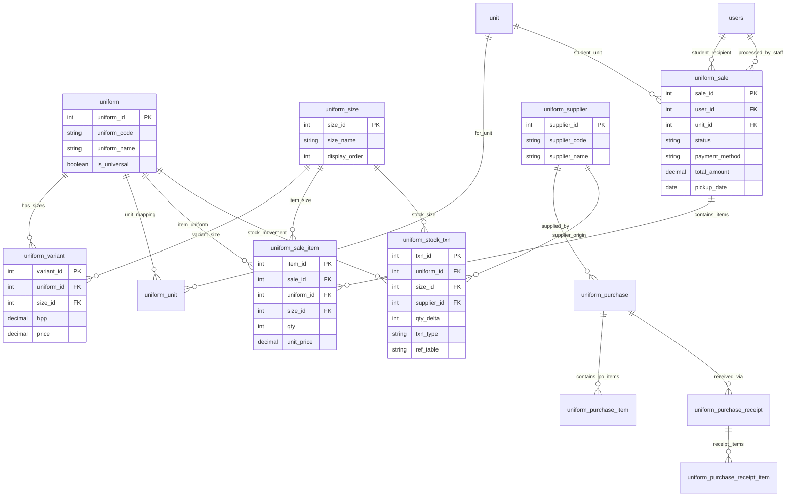
```mermaid
erDiagram
    uniform ||--o{ uniform_variant : "has_sizes"
    uniform_size ||--o{ uniform_variant : "variant_size"
    uniform ||--o{ uniform_unit : "unit_mapping"
    unit ||--o{ uniform_unit : "for_unit"

    users ||--o{ uniform_sale : "student_recipient"
    users ||--o{ uniform_sale : "processed_by_staff"
    unit ||--o{ uniform_sale : "student_unit"
    uniform_sale ||--o{ uniform_sale_item : "contains_items"
    uniform ||--o{ uniform_sale_item : "item_uniform"
    uniform_size ||--o{ uniform_sale_item : "item_size"

    uniform_supplier ||--o{ uniform_purchase : "supplied_by"
    uniform_purchase ||--o{ uniform_purchase_item : "contains_po_items"
    uniform_purchase ||--o{ uniform_purchase_receipt : "received_via"
    uniform_purchase_receipt ||--o{ uniform_purchase_receipt_item : "receipt_items"

    uniform ||--o{ uniform_stock_txn : "stock_movement"
    uniform_size ||--o{ uniform_stock_txn : "stock_size"
    uniform_supplier ||--o{ uniform_stock_txn : "supplier_origin"

    uniform {
        int uniform_id PK
        string uniform_code
        string uniform_name
        boolean is_universal
    }

    uniform_size {
        int size_id PK
        string size_name
        int display_order
    }

    uniform_variant {
        int variant_id PK
        int uniform_id FK
        int size_id FK
        decimal hpp
        decimal price
    }

    uniform_supplier {
        int supplier_id PK
        string supplier_code
        string supplier_name
    }

    uniform_sale {
        int sale_id PK
        int user_id FK
        int unit_id FK
        string status
        string payment_method
        decimal total_amount
        date pickup_date
    }

    uniform_sale_item {
        int item_id PK
        int sale_id FK
        int uniform_id FK
        int size_id FK
        int qty
        decimal unit_price
    }

    uniform_stock_txn {
        int txn_id PK
        int uniform_id FK
        int size_id FK
        int supplier_id FK
        int qty_delta
        string txn_type
        string ref_table
    }
```

### 11.3 Initial Stock & Inventory Ledger Workflows (`/stock/uniform/initial`)

The `/stock/uniform/initial` route handles baseline inventory entry, stock transaction history auditing, live supplier-based stock aggregation, and academic year inventory report exports:

1. **Initial Stock Input (`txn_type = 'init'`):**
   - Records baseline stock items per unit, uniform catalog item (`uniform`), size (`uniform_size`), and vendor (`uniform_supplier` or `NULL` for unallocated stock).
   - Creates ledger entries in `uniform_stock_txn` with `ref_table = 'manual'`, `ref_id = null`, and `txn_type = 'init'`.

2. **Initial Stock Adjustments:**
   - Supports modifying initial stock quantities by updating `qty_delta` directly on target `uniform_stock_txn` records (`txn_type = 'init'`).

3. **Real-time Stock Balance Aggregation:**
   - Calculates live stock per variant & supplier by computing `SUM(qty_delta)` from `uniform_stock_txn` grouped by `(uniform_id, size_id, supplier_id)`.

4. **Academic Year Stock Report Export (`Laporan_Stok_Seragam_*.xlsx`):**
   - Exports formatted Excel workbooks (using ExcelJS) for any selected academic year (`year` table `start_date` to `end_date`).
   - Reconciles inventory balance across all uniform items using the accounting equation:
     $$\text{Stock Akhir} = \text{Stock Awal} + \text{Realisasi Pembelian (PO Receipts)} - \text{Jumlah Terjual (Paid Sales)}$$
   - Calculates weighted average HPP from initial stock entries and `uniform_variant` HPP rates.

5. **Sales Buyer Tracing in Transaction Audit History (`ref_table = 'uniform_sale'`):**
   - For stock movements resulting from uniform sales (`txn_type = 'sale'` with `ref_table = 'uniform_sale'`), the history auditor resolves `ref_id` against `uniform_sale(sale_id)` and `users(user_id)` to display the recipient student/buyer full name (`Terjual ke: [user_nama_depan] [user_nama_belakang]`) directly within the audit notes column.

### 11.4 POS Uniform Sales Workflows (`/sales/uniform`)

The `/sales/uniform` route serves as the Point of Sale (POS) interface for selling school uniforms to students, managing payment methods, tracking pickup dates, generating receipts, and maintaining inventory ledger integrity:

1. **Student Selection & Catalog Filtering:**
   - Filters active students from `users` (where `user_role_id` corresponds to `Student`).
   - Dynamically filters available uniform items based on the student's assigned unit (`user_unit_id`), showing universal uniforms (`is_universal = true`) plus unit-specific uniforms mapped in `uniform_unit`.
   - Computes real-time available stock per variant and per supplier batch from `uniform_stock_txn` (`SUM(qty_delta)` grouped by `uniform_id`, `size_id`, and `supplier_id`).

2. **Cart & Supplier Stock Allocation:**
   - Items added to cart record `uniform_id`, `size_id`, `qty`, `unit_price`, `unit_hpp`, and `supplier_id` (allowing staff to select specific vendor stock or unallocated stock).

3. **Payment Methods & Status Lifecycle:**
   - **`transfer` (Bank Transfer):** Inserts transaction header into `uniform_sale` with `status = 'pending'`. Staff uploads transfer receipt image to Supabase storage bucket `uniform-receipts` (`receipt_url`). Stock is **NOT** deducted while pending. Upon payment verification, marking as paid inserts negative `qty_delta` entries into `uniform_stock_txn` (`txn_type = 'sale'`, `ref_table = 'uniform_sale'`) and updates status to `'paid'`.
   - **`cash` (Cash Payment):** Created in `pending` status, then upon confirmation, stock is deducted via `uniform_stock_txn` and status updated to `'paid'`.
   - **`free` (Promo / Complimentary Uniform):** Sets `unit_price = 0` (`total_amount = 0`), immediately marks status as `'paid'`, sets `pickup_date` to current date, directly deducts stock from `uniform_stock_txn` (`txn_type = 'sale'`, `notes = 'promo free seragam'`), and opens the Kwitansi/Invoice modal directly without requiring payment confirmation.

4. **Pickup Tracking:**
   - Records when uniform items are physically handed over to the student (`pickup_date`). Staff can record or modify pickup dates via the UI modal.

5. **Void / Cancellation Workflow:**
   - Users with void permissions (`can_void_transactions = true` in `role`) can void a transaction (`status = 'voided'`, `is_voided = true`, recording `void_reason`, `voided_at`, and `voided_by`).
   - If a `paid` transaction is voided, positive stock transactions (`qty_delta = +qty`, `txn_type = 'sale'`, `notes = 'void sale #[sale_id]'`) are inserted into `uniform_stock_txn` to restore inventory balances.

6. **Kwitansi & Invoice Generation (`KwitansiModal`):**
   - Displays student name, unit, transaction date, payment method, item breakdown (uniform name, size, quantity, unit price, subtotal), and total amount with browser printing support.

---

## 12. Student Incident Reports & Unit Notification Domain (`/data/incident-report`, `/data/incident-report-approval`, `/settings/incident-report`)

This domain manages student incident reporting, multi-stage status lifecycle (`waiting`, `on_progress`, `completed`), follow-up/feedback timeline logs, and automated unit-level Email & Google Chat notification dispatching.

### 12.0 Dedicated Pages & Access Roles
- **Input & My Reports (`/data/incident-report`):** Form input for teachers/reporters to create new student incident reports and view reports submitted by themselves.
- **Handling & Solution Approval (`/data/incident-report-approval`):** Overview table for Counselors, Principals, Vice Principals, or assigned Unit Handling Staff to review incoming unit reports, track status metrics (`waiting`, `on_progress`, `completed`), and record solutions/follow-ups.
- **Unit Recipient Settings (`/settings/incident-report`):** Per-unit configuration of specific user recipients who receive Email & Google Chat alerts on report submissions and follow-up updates.

### 12.1 Tables

#### `incident_reports`
Main header table storing student incident report submissions.

| Column Name | Type | Description / Constraint |
| --- | --- | --- |
| `id` | `SERIAL` | Primary Key |
| `incident_number` | `VARCHAR(50)` | Unique tracking code (e.g. `INC-202608-001`) |
| `title` | `VARCHAR(255)` | Short title of the incident |
| `student_user_id` | `INTEGER` | FK to `users(user_id)` (The involved student) |
| `reporter_user_id` | `INTEGER` | FK to `users(user_id)` (The submitting teacher/staff) |
| `unit_id` | `INTEGER` | FK to `unit(unit_id)` (Unit of the student/incident) |
| `incident_date` | `DATE` | Date of incident (Defaults to current date) |
| `incident_time` | `TIME` | Time of incident (Defaults to current time) |
| `incident_record` | `VARCHAR(255)` | Manual text entry describing record category/type |
| `description` | `TEXT` | **Describe the case** (Detailed case description) |
| `action_taken` | `TEXT` | **Things done by teacher** (Initial teacher response) |
| `status` | `VARCHAR(30)` | Case status: `'waiting'` (initial), `'on_progress'` / `'in_progress'` (displayed as **"In Progress"**), or `'completed'` |
| `created_at` | `TIMESTAMPTZ` | Record creation timestamp |
| `updated_at` | `TIMESTAMPTZ` | Record update timestamp |

> [!NOTE]
> **Status Lifecycle:** Initial reports start in `'waiting'` status (editable). Once a follow-up action is logged in `incident_followups`, status automatically advances to `'on_progress'` / `'in_progress'` (locking initial report edit, UI displays **"In Progress"**). When fully resolved, it is marked `'completed'`.

#### `incident_followups`
Stores the timeline history of follow-ups and feedback logged for an incident report.

| Column Name | Type | Description / Constraint |
| --- | --- | --- |
| `id` | `SERIAL` | Primary Key |
| `incident_id` | `INTEGER` | FK to `incident_reports(id)` ON DELETE CASCADE |
| `user_id` | `INTEGER` | FK to `users(user_id)` (Staff/Counselor logging follow-up) |
| `followup_date` | `DATE` | Date when follow-up occurred |
| `followup_time` | `TIME` | Time when follow-up occurred |
| `location` | `VARCHAR(255)` | Location of action (e.g. "Counseling Room", "Classroom 8B") |
| `action_details` | `TEXT` | Description of follow-up actions performed |
| `resulting_status` | `VARCHAR(30)` | Resulting status update (`'on_progress'` / `'in_progress'` or `'completed'`) |
| `attachment_url` | `TEXT` | Optional URL of uploaded image attachment / evidence |
| `created_at` | `TIMESTAMPTZ` | Record creation timestamp |

#### `incident_unit_recipients`
Maps specific users per unit who receive Email and Google Chat notification alerts.

| Column Name | Type | Description / Constraint |
| --- | --- | --- |
| `id` | `SERIAL` | Primary Key |
| `unit_id` | `INTEGER` | FK to `unit(unit_id)` ON DELETE CASCADE |
| `user_id` | `INTEGER` | FK to `users(user_id)` ON DELETE CASCADE |
| `(unit_id, user_id)` | `UNIQUE` | Unique constraint per unit and recipient user |

#### `cctv_footage_requests`
Stores security CCTV camera footage review requests submitted by staff and reviewed/approved by Unit Principals and School Admins.

| Column Name | Type | Description / Constraint |
| --- | --- | --- |
| `id` | `BIGINT` | Primary Key (Identity) |
| `request_number` | `VARCHAR(50)` | Unique request identifier (e.g. `CCTV/20260811/001`) |
| `requester_user_id` | `INTEGER` | FK to `users(user_id)` ON DELETE SET NULL |
| `incident_report_id` | `INTEGER` | Optional FK to `incident_reports(id)` ON DELETE SET NULL |
| `cctv_date` | `DATE` | Date of requested CCTV footage |
| `start_time` | `TIME` | Start time of requested footage range |
| `end_time` | `TIME` | End time of requested footage range |
| `room_name` | `VARCHAR(255)` | Requested camera room / location |
| `reason` | `TEXT` | Purpose / justification for requesting CCTV review |
| `status` | `VARCHAR(30)` | Status: `'pending'`, `'approved'`, `'in_progress'`, `'completed'`, `'rejected'` |
| `reviewer_notes` | `TEXT` | Approval notes or Google Drive footage link provided by Principal/Admin |
| `created_at` | `TIMESTAMPTZ` | Timestamp when request was submitted |
| `updated_at` | `TIMESTAMPTZ` | Timestamp when request was last updated |

### 12.2 ERD / Relationships (Incident Reports Domain)

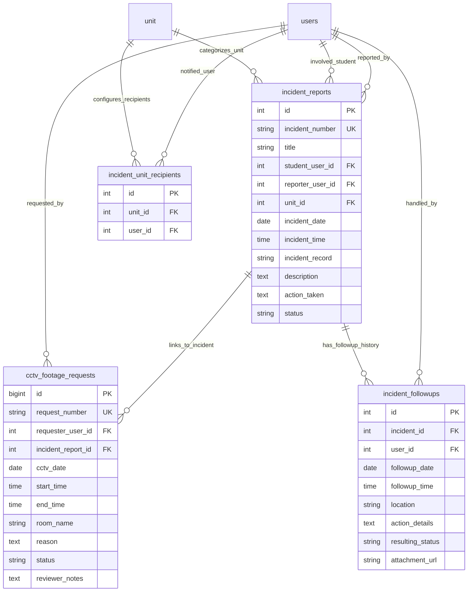
```mermaid
erDiagram
    unit ||--o{ incident_reports : "categorizes_unit"
    users ||--o{ incident_reports : "involved_student"
    users ||--o{ incident_reports : "reported_by"
    incident_reports ||--o{ incident_followups : "has_followup_history"
    users ||--o{ incident_followups : "handled_by"
    unit ||--o{ incident_unit_recipients : "configures_recipients"
    users ||--o{ incident_unit_recipients : "notified_user"
    users ||--o{ cctv_footage_requests : "requested_by"
    incident_reports ||--o{ cctv_footage_requests : "links_to_incident"

    incident_reports {
        int id PK
        string incident_number UK
        string title
        int student_user_id FK
        int reporter_user_id FK
        int unit_id FK
        date incident_date
        time incident_time
        string incident_record
        text description
        text action_taken
        string status
    }

    incident_followups {
        int id PK
        int incident_id FK
        int user_id FK
        date followup_date
        time followup_time
        string location
        text action_details
        string resulting_status
        string attachment_url
    }

    incident_unit_recipients {
        int id PK
        int unit_id FK
        int user_id FK
    }

    cctv_footage_requests {
        bigint id PK
        string request_number UK
        int requester_user_id FK
        int incident_report_id FK
        date cctv_date
        time start_time
        time end_time
        string room_name
        text reason
        string status
        text reviewer_notes
    }
```


7. **Sales Reports & Financial Summary:**
   - Aggregates sales statistics across customizable date ranges: Total Orders Count, Total Revenue (`total_amount`), Total HPP Cost (`total_cost`), Gross Profit ($\text{Total Revenue} - \text{Total Cost}$), and Total Items Sold.

---

### Domain 13: PYP Master Data Framework

1. `pyp_ci_list` — Master Central Ideas
   - `id`: `SERIAL PRIMARY KEY`
   - `name`: `TEXT` (Central Idea statement)
   - `is_deleted`: `SMALLINT DEFAULT 0`
   - `created_by`, `created_at`, `updated_by`, `updated_at`

2. `pyp_loi_list` — Master Lines of Inquiry
   - `id`: `SERIAL PRIMARY KEY`
   - `name`: `TEXT` (Line of Inquiry statement)
   - `is_deleted`: `SMALLINT DEFAULT 0`
   - `created_by`, `created_at`, `updated_by`, `updated_at`

3. `pyp_atls_list` — Master Approaches to Learning
   - `id`: `SERIAL PRIMARY KEY`
   - `name`: `TEXT` (ATL Skill descriptor)
   - `image_url`: `TEXT` (Public URL or path of the uploaded ATL skill icon/image)
   - `icon`: `TEXT` (Identifier or image URL for ATL icon)
   - `is_deleted`: `SMALLINT DEFAULT 0`
   - `created_by`, `created_at`, `updated_by`, `updated_at`

4. `pyp_kc_list` — Master Key Concepts
   - `id`: `SERIAL PRIMARY KEY`
   - `key`: `VARCHAR(255)` (Concept keyword, e.g., Form, Function, Causation)
   - `question`: `TEXT` (Key concept guiding question)
   - `definition`: `TEXT` (Detailed explanation of the key concept)
   - `image_url`: `TEXT` (Public URL or path of the uploaded Key Concept icon/image)
   - `icon`: `TEXT` (Identifier or image URL for Key Concept icon)
   - `is_deleted`: `SMALLINT DEFAULT 0`
   - `created_by`, `created_at`, `updated_by`, `updated_at`

5. `pyp_subject` — Master Subjects per Academic Year for PYP (`/data/pyp-subject`)
   - `id`: `BIGINT GENERATED BY DEFAULT AS IDENTITY PRIMARY KEY`
   - `year_id`: `BIGINT NOT NULL` (FK to `year(year_id)`)
   - `name`: `VARCHAR(255) NOT NULL` (e.g. Language, Mathematics, Science, Arts)
   - `code`: `VARCHAR(50)` (e.g. LANG, MATH, SCI, ARTS)
   - `description`: `TEXT`
   - `icon`: `TEXT`
   - `order_index`: `INTEGER DEFAULT 0`
   - `is_active`: `BOOLEAN DEFAULT TRUE`
   - `created_at`, `updated_at`, `created_by`

6. `pyp_subject_class` — Junction Table linking PYP Subjects to Applicable Classes (`kelas`)
   - `id`: `BIGINT GENERATED BY DEFAULT AS IDENTITY PRIMARY KEY`
   - `subject_id`: `BIGINT NOT NULL` (FK to `pyp_subject(id)` ON DELETE CASCADE)
   - `kelas_id`: `BIGINT NOT NULL` (FK to `kelas(kelas_id)` ON DELETE CASCADE)
   - `created_at`: `TIMESTAMPTZ DEFAULT NOW()`
   - `UNIQUE(subject_id, kelas_id)`

7. `pyp_subject_strand` — Master Subject Strands per Subject
   - `id`: `BIGINT GENERATED BY DEFAULT AS IDENTITY PRIMARY KEY`
   - `subject_id`: `BIGINT NOT NULL` (FK to `pyp_subject(id)` ON DELETE CASCADE)
   - `name`: `VARCHAR(255) NOT NULL` (Strand Name, e.g. Oral Communication, Number, Living Things)
   - `description`: `TEXT` (Learning Outcomes / Guiding Scope & Sequence)
   - `semester`: `VARCHAR(20) DEFAULT '1'` (`'1'`, `'2'`, `'all'`)
   - `order_index`: `INTEGER DEFAULT 0`
   - `is_active`: `BOOLEAN DEFAULT TRUE`
   - `created_at`, `updated_at`, `created_by`

8. `pyp_strand_assessment` — Student Strand Evaluation / Assessments (`/data/pyp` Tab Subject)
   - `id`: `BIGINT GENERATED BY DEFAULT AS IDENTITY PRIMARY KEY`
   - `year_id`: `BIGINT NOT NULL` (FK to `year(year_id)` ON DELETE CASCADE)
   - `kelas_id`: `BIGINT NOT NULL` (FK to `kelas(kelas_id)` ON DELETE CASCADE)
   - `student_id`: `BIGINT NOT NULL` (FK to `users(user_id)` ON DELETE CASCADE)
   - `subject_id`: `BIGINT NOT NULL` (FK to `pyp_subject(id)` ON DELETE CASCADE)
   - `strand_id`: `BIGINT NOT NULL` (FK to `pyp_subject_strand(id)` ON DELETE CASCADE)
   - `semester`: `INTEGER NOT NULL DEFAULT 1` (`1` = Semester 1, `2` = Semester 2)
   - `rating`: `VARCHAR(50) NOT NULL DEFAULT 'N/A'` (`'N/A'`, `'Developing'`, `'Beginning'`, `'Achieving'`, `'Exceeding'`)
   - `created_at`, `updated_at`, `created_by`
   - `UNIQUE(year_id, kelas_id, student_id, strand_id, semester)`

9. `pyp_subject_comment` — Teacher's Report Card Comments per Student per Subject per Semester (`/data/pyp` Tab Teacher Comment)
   - `id`: `BIGINT GENERATED BY DEFAULT AS IDENTITY PRIMARY KEY`
   - `year_id`: `BIGINT NOT NULL` (FK to `year(year_id)` ON DELETE CASCADE)
   - `kelas_id`: `BIGINT NOT NULL` (FK to `kelas(kelas_id)` ON DELETE CASCADE)
   - `student_id`: `BIGINT NOT NULL` (FK to `users(user_id)` ON DELETE CASCADE)
   - `subject_id`: `BIGINT NOT NULL` (FK to `pyp_subject(id)` ON DELETE CASCADE)
   - `semester`: `INTEGER NOT NULL CHECK (semester IN (1, 2))` (`1` = Semester 1, `2` = Semester 2)
   - `comment_text`: `TEXT` (Teacher's end-of-semester holistic comment)
   - `created_at`, `updated_at`, `created_by`
   - `UNIQUE(year_id, kelas_id, student_id, subject_id, semester)`

---

### Domain 14: PYP Unit & Junction Tables (Pivot Models)

1. `pyp_unit` — Dedicated PYP Unit of Inquiry Planners
   - `id`: `bigint GENERATED BY DEFAULT AS IDENTITY PRIMARY KEY`
   - `title`: `TEXT NOT NULL` (Unit Title)
   - `central_idea`: `TEXT NOT NULL` (Central Idea statement)
   - `theme`: `TEXT NOT NULL DEFAULT 'Who We Are'` (Transdisciplinary Theme)
   - `duration_weeks`: `INTEGER DEFAULT 6` (Unit duration in weeks)
   - `semester`: `SMALLINT NOT NULL DEFAULT 1` (1 = Semester 1, 2 = Semester 2)
   - `kelas_id`: `bigint NOT NULL` (FK to `kelas(kelas_id)`)
   - `year_name`: `TEXT` (Academic Year)
   - `status`: `VARCHAR(20) DEFAULT 'published'`
   - `is_deleted`, `created_at`, `created_by`, `updated_at`, `updated_by`, `deleted_at`, `deleted_by`

2. `pyploiunit` — Pivot Unit ↔ Line of Inquiry
   - `id`: `bigint GENERATED BY DEFAULT AS IDENTITY PRIMARY KEY`
   - `"unitId"`: `bigint NOT NULL` (FK to `pyp_unit(id)`)
   - `"loiId"`: `bigint NOT NULL` (FK to `pyp_loi_list(id)`)
   - `is_deleted`, `createdat`, `createdby`, `updatedat`, `updatedby`, `deletedat`, `deletedby`

3. `pypkcunit` — Pivot Unit ↔ Key Concept
   - `id`: `bigint GENERATED BY DEFAULT AS IDENTITY PRIMARY KEY`
   - `"unitId"`: `bigint NOT NULL` (FK to `pyp_unit(id)`)
   - `"kcId"`: `bigint NOT NULL` (FK to `pyp_kc_list(id)`)
   - `keterangan`: `TEXT` (Notes/Specific Key Concept inquiry focus notes)
   - `is_deleted`, `createdat`, `createdby`, `updatedat`, `updatedby`, `deletedat`, `deletedby`

4. `pypatlsunit` — Pivot Unit ↔ Approach to Learning
   - `id`: `bigint GENERATED BY DEFAULT AS IDENTITY PRIMARY KEY`
   - `"unitId"`: `bigint NOT NULL` (FK to `pyp_unit(id)`)
   - `"atlId"`: `bigint NOT NULL` (FK to `pyp_atls_list(id)`)
   - `keterangan`: `TEXT` (Notes/Specific ATL expectations)
   - `is_deleted`, `createdat`, `createdby`, `updatedat`, `updatedby`, `deletedat`, `deletedby`

5. `pypstrandsunit` — Pivot Unit ↔ Subject Strand
   - `id`: `bigint GENERATED BY DEFAULT AS IDENTITY PRIMARY KEY`
   - `"unitId"`: `bigint NOT NULL` (FK to `pyp_unit(id)`)
   - `"subjectId"`: `bigint NOT NULL`
   - `"strandId"`: `bigint NOT NULL`
   - `is_deleted`, `createdat`, `createdby`, `updatedat`, `updatedby`, `deletedat`, `deletedby`

6. `pyp_unit_assessment` — Overall Unit of Inquiry Assessment per Student
   - `id`: `BIGINT GENERATED BY DEFAULT AS IDENTITY PRIMARY KEY`
   - `unit_id`: `BIGINT NOT NULL` (FK to `pyp_unit(id)` ON DELETE CASCADE)
   - `student_id`: `BIGINT NOT NULL` (FK to `users(user_id)` ON DELETE CASCADE)
   - `year_id`: `BIGINT NOT NULL` (FK to `year(year_id)` ON DELETE CASCADE)
   - `kelas_id`: `BIGINT NOT NULL` (FK to `kelas(kelas_id)` ON DELETE CASCADE)
   - `semester`: `SMALLINT NOT NULL DEFAULT 1` (1 = Semester 1, 2 = Semester 2)
   - `rating`: `VARCHAR(50) NOT NULL DEFAULT 'N/A'` (`'N/A'`, `'Beginning'`, `'Developing'`, `'Achieving'`, `'Exceeding'`)
   - `notes`: `TEXT` (Teacher evaluation commentary for this unit)
   - `created_at`, `created_by`, `updated_at`, `updated_by`
   - `UNIQUE(unit_id, student_id)`

7. `pyp_atl_assessment` — Approaches to Learning (ATL) Skill Assessment per Unit per Student
   - `id`: `BIGINT GENERATED BY DEFAULT AS IDENTITY PRIMARY KEY`
   - `unit_id`: `BIGINT NOT NULL` (FK to `pyp_unit(id)` ON DELETE CASCADE)
   - `atl_id`: `BIGINT NOT NULL` (FK to `pyp_atls_list(id)` ON DELETE CASCADE)
   - `student_id`: `BIGINT NOT NULL` (FK to `users(user_id)` ON DELETE CASCADE)
   - `year_id`: `BIGINT NOT NULL` (FK to `year(year_id)` ON DELETE CASCADE)
   - `kelas_id`: `BIGINT NOT NULL` (FK to `kelas(kelas_id)` ON DELETE CASCADE)
   - `semester`: `SMALLINT NOT NULL DEFAULT 1` (1 = Semester 1, 2 = Semester 2)
   - `rating`: `VARCHAR(50) NOT NULL DEFAULT 'N/A'` (`'N/A'`, `'Beginning'`, `'Developing'`, `'Achieving'`, `'Exceeding'`)
   - `created_at`, `created_by`, `updated_at`, `updated_by`
   - `UNIQUE(unit_id, atl_id, student_id)`

---

## 15. Student Admission & Enrollment Domain (`/login`, `/admission`, `/admission/status`, `/data/admission`, `/data/admission-level`, `/data/school-fee`)

This domain manages the full admissions lifecycle for prospective students (PPDB / SPMB). It bridges public prospective applicants with the school backoffice:
- **Public Portal Access (`/login`):** An accordion section on the login screen ("Pendaftaran Siswa Baru") provides direct routing to `/admission` (application form) and `/admission/status` (application tracking).
- **Online Registration Form (`/admission`):** Prospective parents submit student biodata, parents/guardian contact info, select academic unit, specific enrollment level (`admission_level`), and target academic year.
- **Status & Tracking (`/admission/status`):** Public self-service tracking using application number and parent phone/email.
- **Backoffice Processing (`/data/admission`):** Administrators review applicant submissions, manage fee quotations, apply stackable discounts, configure installment plans (UTJ / DP and monthly splits), approve/reject applications, generate PDF quotation slips, and dispatch automated WhatsApp and Email notifications.
- **Admission Level Management (`/data/admission-level`):** Subdivides organizational units (`unit`) into granular enrollment grades (e.g. Nursery 1-2, K1-K2, Elementary 1-6, JHS, SHS).
- **Tuition & Discount Management (`/data/school-fee`):** Configures baseline development funds (`udp_definition`), monthly tuition (`school_fee_definition`), and discount master catalogs (`fee_discount`).

### 15.1 Tables

#### `admission_level`
Subdivides academic units (`unit`) into specific enrollment levels and grade tiers.

| Column Name | Type | Description / Constraint |
| --- | --- | --- |
| `level_id` | `SERIAL` | Primary Key |
| `unit_id` | `INTEGER` | FK to `unit(unit_id)` ON DELETE CASCADE |
| `level_name` | `VARCHAR(100)` | Name of the level (e.g., "Nursery 1", "Kindergarten 1", "Elementary 1-6", "Junior High School", "Senior High School") |
| `level_order` | `INTEGER` | Sort order for display (Default `0`) |
| `is_active` | `BOOLEAN` | Default `true` |
| `created_at` | `TIMESTAMPTZ` | Record creation timestamp |
| `updated_at` | `TIMESTAMPTZ` | Record update timestamp |
| `CONSTRAINT` | `UNIQUE` | `(unit_id, level_name)` |

#### `admission_form_fee`
Master table defining periodic/wave-based registration form fees (e.g. Early Bird vs Reguler). Managed via `/data/school-fee` (Tab 3: "Biaya Formulir Pendaftaran").

| Column Name | Type | Description / Constraint |
| --- | --- | --- |
| `fee_id` | `SERIAL` | Primary Key |
| `year_id` | `INTEGER` | FK to `year(year_id)` ON DELETE CASCADE |
| `unit_id` | `INTEGER` | Nullable FK to `unit(unit_id)` ON DELETE SET NULL |
| `level_id` | `INTEGER` | Nullable FK to `admission_level(level_id)` ON DELETE SET NULL |
| `wave_name` | `VARCHAR(100)` | Name of the wave (e.g. "Gelombang 1 - Early Bird", "Gelombang 2 - Reguler") |
| `amount` | `NUMERIC(12,2)` | Application form fee price (Must be $\ge 0$) |
| `effective_from` | `DATE` | Wave start date |
| `effective_until` | `DATE` | Wave expiration date |
| `is_active` | `BOOLEAN` | Default `true` *(Legacy column; wave selection is now 100% automated by calendar dates)* |
| `notes` | `TEXT` | Wave promotional notes / discounts |
| `created_at` | `TIMESTAMPTZ` | Record creation timestamp |
| `updated_at` | `TIMESTAMPTZ` | Record update timestamp |
| `CONSTRAINT` | `UNIQUE` | `(wave_name, effective_from)` |

> [!IMPORTANT]
> **100% Date-Driven Wave Resolution Policy (No Manual Toggle):**
> To prevent human oversight (e.g. forgetting to toggle an active switch when a scheduled date arrives), wave selection is **purely automated based on calendar dates** (`effective_from` to `effective_until`). Manual toggle switches have been retired from both `/data/school-fee` and `/api/public/admission`.
>
> **Lookup Fallback Algorithm (`resolveCurrentFormFee`):**
> 1. **Active Wave:** Matches `effective_from <= targetDate <= effective_until`.
> 2. **Earliest Upcoming (Pre-Wave Intake):** If the current date is before any scheduled wave has begun (`effective_from > targetDate`), the system automatically adopts the **earliest upcoming wave** (`ORDER BY effective_from ASC LIMIT 1`) so prospective parents submitting early inquiries receive valid fee invoices rather than an error or empty amount.
> 3. **Latest Historical:** If all scheduled waves have expired (`effective_until < targetDate`), the system falls back to the **latest expired wave** (`ORDER BY effective_until DESC LIMIT 1`).
> 4. **Hard Fallback:** If `admission_form_fee` table is completely empty, defaults to IDR 250,000.
>
> **Admin Display (`/data/school-fee` Tab 3):**
> The table computes wave status on the fly without relying on `is_active`:
> - **Sedang Berjalan (Green badge):** `effective_from <= today <= effective_until`
> - **Akan Datang (Yellow badge):** `today < effective_from`
> - **Selesai (Gray badge):** `today > effective_until`

#### `student_applications`
Primary record for each prospective student's application form submission.

| Column Name | Type | Description / Constraint |
| --- | --- | --- |
| `application_id` | `BIGSERIAL` | Primary Key |
| `application_number` | `VARCHAR(20)` | Unique registration code auto-generated via trigger (e.g., `REG-2026-000001`) |
| `student_name` | `VARCHAR(255)` | Full name of prospective student |
| `student_nickname` | `VARCHAR(100)` | Nickname / panggilan |
| `student_gender` | `VARCHAR(10)` | Gender: `'male'` or `'female'` |
| `student_birth_date` | `DATE` | Date of birth |
| `student_birth_place` | `VARCHAR(100)` | Place of birth |
| `student_religion` | `VARCHAR(30)` | Religion: `'Islam'`, `'Kristen'`, `'Katolik'`, `'Hindu'`, `'Buddha'`, `'Konghucu'`, or `'Lainnya'` |
| `student_nationality` | `VARCHAR(10)` | Nationality: `'WNI'` (Default) or `'WNA'` |
| `student_address` | `TEXT` | Address as listed on KTP / ID card |
| `student_domicile_address` | `TEXT` | Domicile address (if different from ID) |
| `student_city` | `VARCHAR(100)` | Domicile city |
| `student_province` | `VARCHAR(100)` | Domicile province |
| `student_postal_code` | `VARCHAR(10)` | Postal code |
| `student_previous_school` | `VARCHAR(255)`| Previous school attended |
| `parent_name` | `VARCHAR(255)` | Parent / guardian full name |
| `parent_phone` | `VARCHAR(20)` | Parent mobile / WhatsApp contact phone number |
| `parent_email` | `VARCHAR(255)` | Parent email address |
| `parent_occupation` | `VARCHAR(100)`| Parent occupation / profession |
| `parent_address` | `TEXT` | Parent address |
| `parent_nik` | `VARCHAR(20)` | Parent National Identification Number (NIK) |
| `unit_id` | `INTEGER` | FK to `unit(unit_id)` (Selected school unit) |
| `level_id` | `INTEGER` | FK to `admission_level(level_id)` (Selected grade level) |
| `year_id` | `INTEGER` | FK to `year(year_id)` (Target academic year) |
| `preferred_grade` | `VARCHAR(50)` | Legacy optional free-text grade (superseded by `level_id`) |
| `additional_notes` | `TEXT` | Special notes from applicant |
| `status` | `VARCHAR(20)` | Application lifecycle status: `'pending'`, `'under_review'`, `'approved'`, `'rejected'`, `'waitlist'` (Default `'pending'`) |
| `form_fee_amount` | `NUMERIC(12,2)`| Form fee price snapshot charged at registration date |
| `form_fee_status` | `VARCHAR(30)` | Payment verification status: `'pending_payment'`, `'proof_uploaded'`, `'verified'`, `'rejected'` (Default `'pending_payment'`) |
| `payment_proof_file` | `TEXT` | Uploaded transfer receipt filename / URL |
| `access_token` | `VARCHAR(64)` | Secret PIN / Access code for applicant self-service login and receipt upload on `ccs.sch.id` |
| `wave_name` | `VARCHAR(100)` | Name of active pricing wave during registration |
| `hosting_url` | `TEXT` | Origin cPanel hosting URL (e.g. `https://ccs.sch.id/registrasi`) |
| `is_form_completed` | `BOOLEAN` | Default `false` (Flag indicating whether parent has completed the full student biographical form after payment verification) |
| `paid_at` | `TIMESTAMPTZ` | Timestamp when payment proof was uploaded |
| `verified_by` | `INTEGER` | FK to `users(user_id)` (Staff who verified payment) |
| `verified_at` | `TIMESTAMPTZ` | Timestamp when payment was approved |
| `admin_notes` | `TEXT` | Internal remarks from school admission committee |
| `reviewed_by` | `INTEGER` | FK to `users(user_id)` (Staff reviewer) |
| `reviewed_at` | `TIMESTAMP` | Timestamp of administrative review |
| `created_at` | `TIMESTAMPTZ` | Record creation timestamp |
| `updated_at` | `TIMESTAMPTZ` | Record update timestamp |

> [!NOTE]
> **Application Number Generation:** A PostgreSQL function `generate_application_number()` and trigger `trigger_generate_application_number` automatically formats numbers as `REG-YYYY-NNNNNN` on insert, resetting sequence numbering per calendar year.
>
> **Access & RLS Policies:**
> - `public_insert_applications`: Unauthenticated public visitors can insert new applications from `/admission`.
> - `public_read_own_application`: Filtered in application logic by `application_number` + `parent_phone` / `parent_email` for `/admission/status`.
> - `admin_read_all_applications` & `admin_update_applications`: Authenticated backoffice staff have full management access.
>
> **Two-Stage Progressive Intake & Email-Driven Payment Architecture:**
> - **Primary Public Portal:** Hosted on cPanel hosting at `https://ccs.sch.id/registrasi` (`cpanel-registrasi/index.php`). Communicates with Next.js API `/api/public/admission` via Bearer token (`API_SECRET_TOKEN`).
> - **Stage 1 (Lightweight Intake):** Prospective parents submit only 4 core fields: `level_name`, `student_name`, `parent_email`, and `parent_phone`. **No form fee price is displayed on the web form or the confirmation screen.**
> - **Email-Only Invoice Delivery:** Upon submission, `/api/public/admission` resolves the current date's wave from `admission_form_fee`, locks `form_fee_amount` and `wave_name` onto `student_applications`, sets `form_fee_status = 'pending_payment'`, and dispatches an official transactional email containing:
>   - Registration code (`application_number`)
>   - Snapshot form fee amount (e.g. `Rp 250.000`)
>   - Official school bank account: **Bank Mayapada** `100-3000-3853` a/n **Yayasan Pendidikan Mayapada School**
>   - Direct link to upload payment proof
> - **Stage 2 (Proof Upload):** Parents transfer and submit transfer receipt through the portal (`action_upload_proof`). The image/PDF is stored in cPanel `uploads/` (restricted via `.htaccess`) and updates `form_fee_status = 'proof_uploaded'`.
> - **Stage 3 (Backoffice Verification):** Admissions staff review and approve the payment in `/data/admission`, updating `form_fee_status = 'verified'`.
> - **Stage 4 (Full Biodata Form Unlock):** When the parent accesses the portal again, the system detects `form_fee_status === 'verified'` and unlocks the comprehensive background form (NIK, birth details, religion, nationality, previous school, domicile). Submitting updates `is_form_completed = true`.

#### `udp_definition`
Master definition of Uang Dana Pembangunan (UDP) / Uang Pangkal / DPP per grade level and academic year.

| Column Name | Type | Description / Constraint |
| --- | --- | --- |
| `udp_def_id` | `BIGSERIAL` | Primary Key |
| `unit_id` | `BIGINT` | FK to `unit(unit_id)` ON DELETE CASCADE |
| `level_id` | `INTEGER` | FK to `admission_level(level_id)` |
| `year_id` | `BIGINT` | FK to `year(year_id)` ON DELETE CASCADE |
| `total_amount` | `NUMERIC(12,2)` | Base gross development fee amount (Must be $\ge 0$) |
| `student_category` | `VARCHAR(20)` | Target applicant category: `'eksternal'` (Default) or `'internal'` (graduating from internal unit) |
| `default_installments` | `INTEGER` | Suggested standard number of installments |
| `effective_from` | `DATE` | Start date of pricing period (e.g. Early Bird wave) |
| `effective_until` | `DATE` | End date of pricing period |
| `notes` | `TEXT` | Pricing remarks / wave name |
| `is_active` | `BOOLEAN` | Default `true` |
| `created_by` | `INTEGER` | FK to `users(user_id)` |
| `updated_by` | `INTEGER` | FK to `users(user_id)` |
| `created_at` | `TIMESTAMPTZ` | Record creation timestamp |
| `updated_at` | `TIMESTAMPTZ` | Record update timestamp |
| `CONSTRAINT` | `UNIQUE` | `(level_id, year_id, student_category, effective_from)` |

#### `udp_installment_plan`
Pre-defined monthly breakdown schedules for a given UDP definition.

| Column Name | Type | Description / Constraint |
| --- | --- | --- |
| `plan_id` | `BIGSERIAL` | Primary Key |
| `udp_def_id` | `BIGINT` | FK to `udp_definition(udp_def_id)` ON DELETE CASCADE |
| `seq` | `INTEGER` | Term sequence number ($1, 2, \dots$) |
| `month` | `INTEGER` | Target calendar month ($1 \dots 12$) |
| `amount` | `NUMERIC(12,2)` | Scheduled installment amount |
| `due_date` | `DATE` | Payment due date |
| `created_at` | `TIMESTAMPTZ` | Record creation timestamp |
| `updated_at` | `TIMESTAMPTZ` | Record update timestamp |
| `CONSTRAINT` | `UNIQUE` | `(udp_def_id, seq)` and `(udp_def_id, month)` |

#### `school_fee_definition`
Master definition of recurring monthly tuition (SPP / USEK) per grade level and academic year.

| Column Name | Type | Description / Constraint |
| --- | --- | --- |
| `fee_def_id` | `BIGSERIAL` | Primary Key |
| `unit_id` | `BIGINT` | FK to `unit(unit_id)` ON DELETE CASCADE |
| `level_id` | `INTEGER` | FK to `admission_level(level_id)` |
| `year_id` | `BIGINT` | FK to `year(year_id)` ON DELETE CASCADE |
| `monthly_amount` | `NUMERIC(12,2)` | Base monthly SPP tuition (Must be $\ge 0$) |
| `notes` | `TEXT` | Tuition notes |
| `is_active` | `BOOLEAN` | Default `true` |
| `created_by` | `INTEGER` | FK to `users(user_id)` |
| `updated_by` | `INTEGER` | FK to `users(user_id)` |
| `created_at` | `TIMESTAMPTZ` | Record creation timestamp |
| `updated_at` | `TIMESTAMPTZ` | Record update timestamp |
| `CONSTRAINT` | `UNIQUE` | `(level_id, year_id)` |

#### `fee_discount`
Master catalog of available fee discounts and bursaries.

| Column Name | Type | Description / Constraint |
| --- | --- | --- |
| `discount_id` | `BIGSERIAL` | Primary Key |
| `unit_id` | `INTEGER` | FK to `unit(unit_id)` ON DELETE CASCADE |
| `level_id` | `INTEGER` | Nullable FK to `admission_level(level_id)` (NULL = applies to all levels within unit) |
| `year_id` | `INTEGER` | FK to `year(year_id)` ON DELETE CASCADE |
| `discount_code` | `VARCHAR(50)` | Short promotional code (e.g. `SIBLING-5`, `EARLY-BIRD-1M`) |
| `discount_name` | `VARCHAR(255)` | Human-readable discount title |
| `discount_description`| `TEXT` | Eligibility details |
| `discount_type` | `VARCHAR(20)` | Calculation formula: `'percentage'` or `'fixed'` |
| `discount_value` | `NUMERIC(12,2)`| Value (e.g. `5.00` for 5% or `1000000.00` for IDR 1,000,000) |
| `applies_to` | `VARCHAR(20)` | Target fee: `'udp'`, `'usek'`, or `'both'` |
| `valid_from` | `DATE` | Promo validity start date |
| `valid_until` | `DATE` | Promo validity expiration date |
| `is_active` | `BOOLEAN` | Default `true` |
| `max_usage` | `INTEGER` | Maximum allowed redemptions (Nullable) |
| `current_usage` | `INTEGER` | Current times redeemed (Default `0`) |
| `conditions` | `JSONB` | Flexible structured eligibility rules |
| `created_by` | `INTEGER` | FK to `users(user_id)` |
| `updated_by` | `INTEGER` | FK to `users(user_id)` |
| `created_at` | `TIMESTAMPTZ` | Record creation timestamp |
| `updated_at` | `TIMESTAMPTZ` | Record update timestamp |
| `CONSTRAINT` | `UNIQUE` | `(unit_id, year_id, discount_code)` |

#### `application_discount`
Stackable discounts applied to a specific student's application.

| Column Name | Type | Description / Constraint |
| --- | --- | --- |
| `app_discount_id` | `BIGSERIAL` | Primary Key |
| `application_id` | `BIGINT` | FK to `student_applications(application_id)` ON DELETE CASCADE |
| `discount_id` | `BIGINT` | FK to `fee_discount(discount_id)` |
| `fee_target` | `VARCHAR(10)` | Target category: `'udp'` or `'usek'` |
| `seq` | `INTEGER` | Application calculation sequence ($1, 2, \dots$) |
| `value_type` | `VARCHAR(20)` | `'percentage'` or `'fixed'` (Can be overridden from master) |
| `value` | `NUMERIC(12,2)`| Applied percentage or fixed deduction value |
| `base_before` | `NUMERIC(12,2)`| Subtotal amount prior to applying this discount line |
| `calculated_amount` | `NUMERIC(12,2)`| Net deduction amount |
| `subtotal_after` | `NUMERIC(12,2)`| Resulting balance after deduction |
| `notes` | `TEXT` | Auditor notes / justification |
| `created_by` | `INTEGER` | FK to `users(user_id)` |
| `created_at` | `TIMESTAMPTZ` | Record creation timestamp |
| `updated_at` | `TIMESTAMPTZ` | Record update timestamp |
| `CONSTRAINT` | `UNIQUE` | `(application_id, fee_target, discount_id)` and `(application_id, fee_target, seq)` |

#### `application_installment`
Custom entry cost financing and installment schedule configured for an applicant.

| Column Name | Type | Description / Constraint |
| --- | --- | --- |
| `installment_id` | `BIGSERIAL` | Primary Key |
| `application_id` | `BIGINT` | FK to `student_applications(application_id)` ON DELETE CASCADE (Unique 1:1) |
| `udp_amount` | `NUMERIC(12,2)`| Final net UDP development fee (after applied discounts) |
| `spp_first_amount` | `NUMERIC(12,2)`| Final net first-month SPP tuition (after applied discounts) |
| `total_entry_cost` | `NUMERIC(12,2)`| Total initial entry obligation: $\text{UDP} + \text{First Month SPP}$ |
| `utj_percentage` | `NUMERIC(5,2)` | Down payment percentage (Uang Tanda Jadi, default `30.00%`, $0 \dots 100$) |
| `utj_amount` | `NUMERIC(12,2)`| Calculated initial booking down payment: $\text{Total Entry Cost} \times \text{UTJ\%}$ |
| `remaining_amount` | `NUMERIC(12,2)`| Balance to finance: $\text{Total Entry Cost} - \text{UTJ Amount}$ |
| `num_installments` | `INTEGER` | Number of monthly installments (Default `11`, must be $\ge 1$) |
| `monthly_installment`| `NUMERIC(12,2)`| Monthly installment amount: $\lfloor \text{remaining\_amount} / \text{num\_installments} \rfloor$ |
| `start_month` | `INTEGER` | Installment start month (Default `7` = July, range $1 \dots 12$) |
| `start_year` | `INTEGER` | Installment start calendar year (e.g. `2026`) |
| `notes` | `TEXT` | Special financial arrangement notes |
| `created_by` | `INTEGER` | FK to `users(user_id)` |
| `created_at` | `TIMESTAMPTZ` | Record creation timestamp |
| `updated_at` | `TIMESTAMPTZ` | Record update timestamp |

---

### 15.2 ERD / Relationships (Admissions Domain)

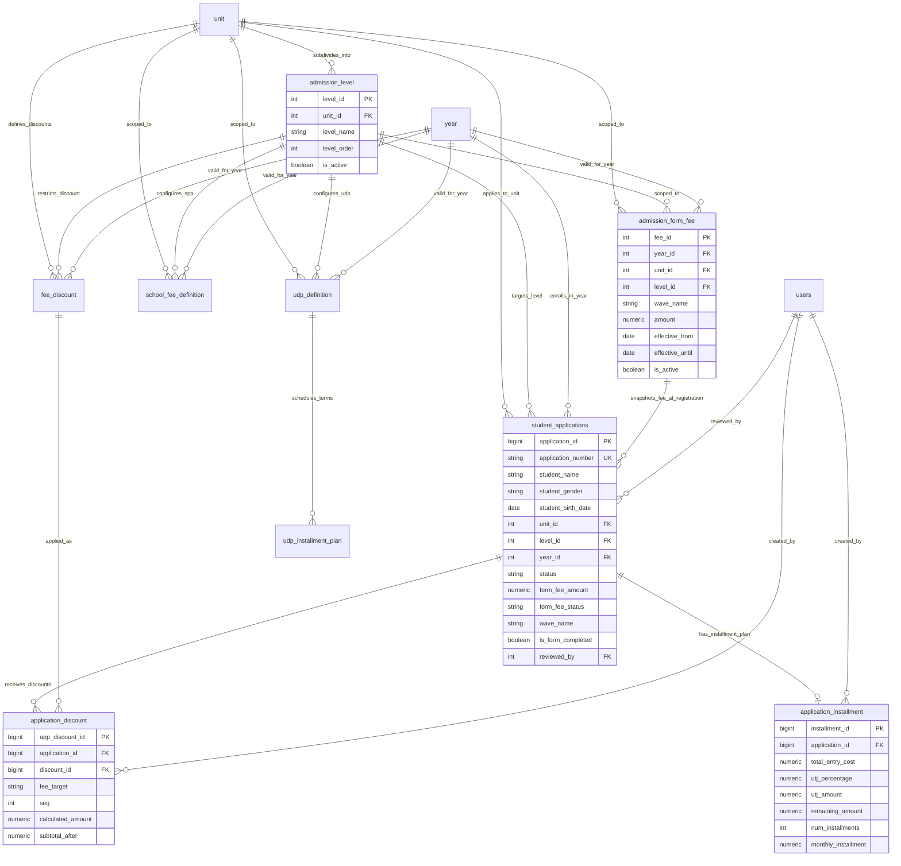
```mermaid
erDiagram
    unit ||--o{ admission_level : "subdivides_into"
    unit ||--o{ student_applications : "applies_to_unit"
    unit ||--o{ udp_definition : "scoped_to"
    unit ||--o{ school_fee_definition : "scoped_to"
    unit ||--o{ fee_discount : "defines_discounts"
    unit ||--o{ admission_form_fee : "scoped_to"
    
    admission_level ||--o{ student_applications : "targets_level"
    admission_level ||--o{ udp_definition : "configures_udp"
    admission_level ||--o{ school_fee_definition : "configures_spp"
    admission_level ||--o{ fee_discount : "restricts_discount"
    admission_level ||--o{ admission_form_fee : "scoped_to"
    
    year ||--o{ student_applications : "enrolls_in_year"
    year ||--o{ udp_definition : "valid_for_year"
    year ||--o{ school_fee_definition : "valid_for_year"
    year ||--o{ fee_discount : "valid_for_year"
    year ||--o{ admission_form_fee : "valid_for_year"
    
    admission_form_fee ||--o{ student_applications : "snapshots_fee_at_registration"
    udp_definition ||--o{ udp_installment_plan : "schedules_terms"
    
    student_applications ||--o{ application_discount : "receives_discounts"
    student_applications ||--o| application_installment : "has_installment_plan"
    fee_discount ||--o{ application_discount : "applied_as"
    
    users ||--o{ student_applications : "reviewed_by"
    users ||--o{ application_installment : "created_by"
    users ||--o{ application_discount : "created_by"

    admission_form_fee {
        int fee_id PK
        int year_id FK
        int unit_id FK
        int level_id FK
        string wave_name
        numeric amount
        date effective_from
        date effective_until
        boolean is_active
    }

    student_applications {
        bigint application_id PK
        string application_number UK
        string student_name
        string student_gender
        date student_birth_date
        int unit_id FK
        int level_id FK
        int year_id FK
        string status
        numeric form_fee_amount
        string form_fee_status
        string wave_name
        boolean is_form_completed
        int reviewed_by FK
    }

    admission_level {
        int level_id PK
        int unit_id FK
        string level_name
        int level_order
        boolean is_active
    }

    application_installment {
        bigint installment_id PK
        bigint application_id FK
        numeric total_entry_cost
        numeric utj_percentage
        numeric utj_amount
        numeric remaining_amount
        int num_installments
        numeric monthly_installment
    }

    application_discount {
        bigint app_discount_id PK
        bigint application_id FK
        bigint discount_id FK
        string fee_target
        int seq
        numeric calculated_amount
        numeric subtotal_after
    }
```

---

### 15.3 Admissions Lifecycle & Operational Integration

```
[ Public Intake Client ] (https://ccs.sch.id/registrasi - cPanel PHP)
   │
   │ 1. POST /api/public/admission (4 fields: Name, Level, Email, Phone)
   ▼
[ Next.js API: resolveCurrentFormFee() ] ──(Date-Driven Lookup)──> [ admission_form_fee ]
   │
   ├─► [ Insert student_applications ] (Status: 'pending', form_fee_status: 'pending_payment')
   │
   └─► [ Send Transactional Email ] (Bank Mayapada 100-3000-3853 + Form Fee + Tracking Link)
                                       │
                                       ▼ (Parent Transfers & Uploads Proof)
                              [ Upload Transfer Proof ] 
                       (cPanel uploads/ + form_fee_status: 'proof_uploaded')
                                       │
                                       ▼
                              [ /data/admission ]
                         (Staff Review & Verification)
                                       │
                                       ▼ (Admin Marks: 'verified')
                       [ Full Biodata Form Unlocked ]
            (Parent fills NIK, Parents, Address -> is_form_completed = true)
                                       │
                                       ▼
            ┌──────────────────────────┼──────────────────────────┐
            ▼                          ▼                          ▼
  [ Configure Discounts ]    [ Setup Installments ]       [ Final Decision ]
  (application_discount)     (application_installment)        │
                                                    ┌─────────┴─────────┐
                                                    ▼                   ▼
                                               'approved'          'rejected'
                                                    │                   │
                                             (WhatsApp/Email     (WhatsApp/Email
                                              Notifications)      Notifications)
                                                    │
                                                    ▼ (Current Manual Step)
                                         [ users ] & [ detail_siswa ]
                                       (Active Student Class Enrollment)
```

1. **Public Intake via `ccs.sch.id/registrasi` & `/login`:**
   - **Main Parent Portal:** Prospective families access `https://ccs.sch.id/registrasi` (cPanel PHP client).
   - **Direct Next.js Portal (`/login`):** An accordion section on the school portal provides direct routing to `/admission` and `/admission/status`.
   - **Progressive Disclosure:** Parents do **not** choose or view form fee prices during stage 1. The backend automatically determines the active wave fee based on the submission date.
   - **Credential Separation:** Submitting this form does **not** create a login credential in `users`. Prospective families interact purely through the public status page, WhatsApp, and Email channels until official acceptance and school onboarding.

2. **Automated Wave Pricing & Transactional Email:**
   - On submission, `/api/public/admission` calls `resolveCurrentFormFee()` to match `effective_from <= today <= effective_until`.
   - The fee is locked into `student_applications.form_fee_amount` and `wave_name`.
   - An official email invoice is automatically dispatched via `emailTemplates.admissionRegistrationPayment` containing the registration code, exact form fee amount, and official Bank Mayapada account details (`100-3000-3853` a/n `Yayasan Pendidikan Mayapada School`).

3. **Payment Verification & Progressive Form Unlock:**
   - Parents upload transfer receipts via the self-service portal (`form_fee_status = 'proof_uploaded'`).
   - Admissions committee verifies payment in `/data/admission` (`form_fee_status = 'verified'`).
   - Upon verification, the portal unlocks the complete candidate biographical form. Once submitted, `is_form_completed = true`.

4. **Automated Quotation & Installment Stacking:**
   - Base fees are pulled from `udp_definition` (matching the applicant's category: `internal` vs `eksternal`, and current date vs `effective_from` / `effective_until`) and `school_fee_definition`.
   - Discounts from `fee_discount` can be stacked sequentially (`seq = 1, 2, \dots`). Each sequential line recomputes `subtotal_after` based on the previous line's `base_before`.
   - The financing scheme in `application_installment` locks the down payment (UTJ 30%) and calculates an even 11-month payment distribution starting in July.

5. **Status Progression & External Notifications:**
   - When administrators transition status to `'approved'` or `'rejected'`, API routes `/api/whatsapp/send` and `/api/email/admission` fire automated transactional notifications to the registered parent contact.

6. **Integration Gap & Transition to Active Students:**
   - In the current implementation, an `'approved'` application in `student_applications` does not automatically spawn a row in `users` and `detail_siswa`.
   - Staf Tata Usaha manually copies accepted candidate records into `/data/user` (assigning `role.is_student = true`) and enrolls them into `/data/class` (`detail_siswa`).


